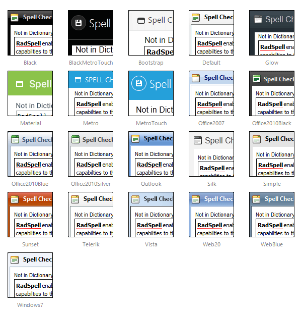

# Skins

To make customizing the appearance of the **RadSpellChecker** dialog as easy as possible, the dialog uses **skins**. A skin is a set of images and a CSS stylesheet that are applied to the HTML elements which make up the dialog, defining the look and feel.

To apply a skin, set the **Skin** property of the **RadSpellChecker** control.	You can set the **Skin** property using the properties pane or the control's [Smart Tag]().

**RadSpellChecker** is installed with a number of predefined skins: 

 @[template - Material skin is available only in Lightweight mode](/_templates/common/skins-notes.md#material-only-in-lightweight) 

