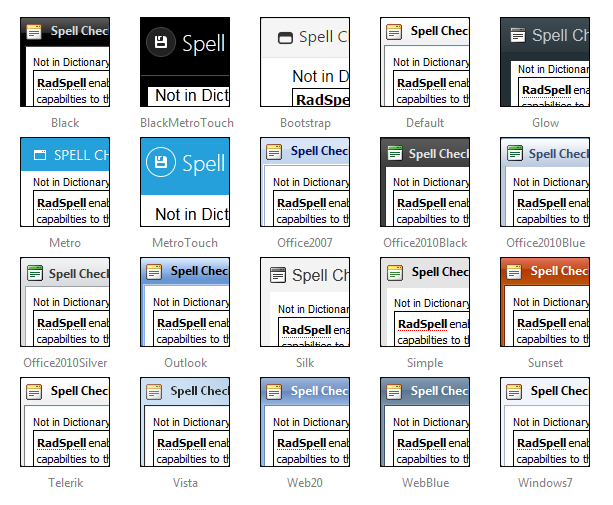

# Skins

To make customizing the appearance of the **RadSpellChecker** dialog as easy as possible, the dialog uses **skins**. A skin is a set of images and a CSS stylesheet that are applied to the HTML elements which make up the dialog, defining the look and feel.

To apply a skin, set the **Skin** property of the **RadSpellChecker** control.	You can set the **Skin** property using the properties pane or the control's [Smart Tag]().

**RadSpellChecker** is installed with a number of predefined skins:

>note The **Hay** , **Forest** , **Sitefinity** and **Transparent** skins are obsolete and have been removed from the Telerik.Web.UI.Skins.dll assembly as of **Q1 2014**. You can find more information on the matter in [this blog post](http://blogs.telerik.com/aspnet-ajax/posts/13-04-11/6-telerik-asp.net-ajax-skins-going-obsolete).

