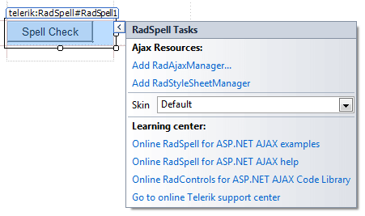

# Design Time

You can display the Smart Tag by right clicking on a **RadSpell** control and choosing "Show Smart Tag" or by clicking the small rightward pointing arrow at the upper right of the control.

## Ajax Resources

* **Add RadAjaxManager...** adds a **RadAjaxManager** component to your Web page, and displays the **r.a.d.ajax Property Builder** where you can configure it.

* Add **RadStyleSheetManager** adds a **RadStyleSheetManager** to your Web page.

## Skin

The **Skin** drop-down displays a list of available [skins]() that you can apply to your control, along with an example of what the dialog for **RadSpell** control looks like for each skin. Assign a skin by selecting from the drop down list.

## Learning Center

Links navigate you directly to RadSpell examples, help, and code library.
