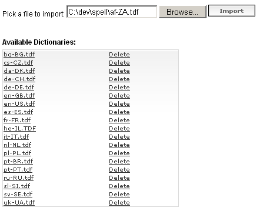
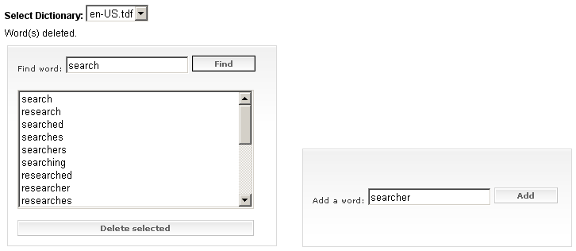
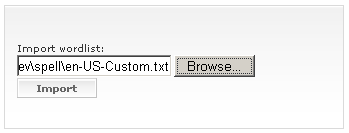

# Dictionary Configurator

## 

The Dictionary Configurator tool is useful for creating new dictionary files and editing existing dictionaries. The Dictionary Configurator tool is attached as a web project in the following code-library project: [Dictionary Configuration](http://www.telerik.com/support/code-library/dictionary-configuration).

Using the __Dictionary Configurator__ tool you can:

1. __Import a new dictionary__: Import files are text files, having one word per line with no leading or trailing whitespace.Old TDF files are suitable too.
>caption 

1. __Edit dictionaries__: You can add and delete words to/from a selected custom dictionary file. You can also search for words or for the occurrence of a given string in dictionary files.
>caption 

1. You can also import wordlists in the currently selected dictionary:
>caption 

Wordlists should follow the same import format as custom dictionaries, e.g. the imported text files, should have one word per line with no leading or trailing whitespaces.
