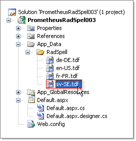
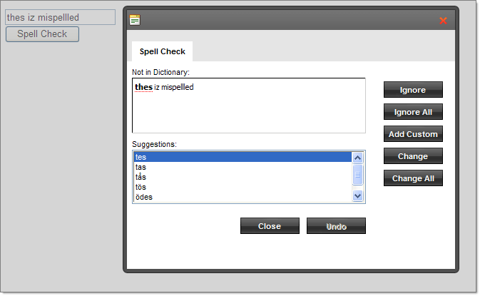

# Dictionaries Overview


## 

**RadSpell** currently supports dozens of languages. However, the control distribution includes only 3 of them: English (American), German and French. You can download the rest of the dictionary packages from [this forum thread](http://www.telerik.com/community/forums/aspnet-ajax/spell/147971-radspell-dictionaries.aspx).

Download the dictionary package for your desired language. Locate the App_Data folder in your application. Find the RadSpell\TDF subfolder and extract the files to a folder, named after the language. For example if you downloaded the bulgarian package you need to extract the dictionary in **~\App_Data\RadSpell\**.

The names of the folder and the TDF file are not obligatory, you can use whatever name you want. You only need to make sure that the names are equal and you set the **SupportedLanguages** and **DictionaryLanguage** properties with that name.

In the example project below the Swedish dictionary with Swedish culture code "sv-SE" is added to the App_Data\RadSpell directory.
>caption 



DictionaryLanguage is set to the corresponding "sv-SE" Swedish culture code.

````ASPNET
	<asp:TextBox ID="TextBox1" runat="server">thes iz mispellled</asp:TextBox>
	<telerik:RadSpell
	   ID="RadSpell1"
	   runat="server"
	   ButtonType="PushButton"
	   ControlToCheck="TextBox1"
	   DictionaryLanguage="sv-SE"
	/> 
````


The resulting spell check lists the words from the Swedish dictionary.
>caption 



# See Also

 * [Custom Dictionaries]()

 * [Dictionary Configurator]()

 * [RadSpell Dictionaries (Forum)](http://www.telerik.com/community/forums/aspnet-ajax/spell/147971-radspell-dictionaries.aspx)
