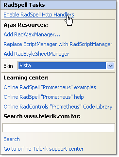

# Getting Started

The following tutorial demonstrates using RadSpell to spell check a standard ASP.NET TextBox control using either an English or French dictionary. The walk-through will also show how to change the skin of the spell check dialog.

1. In the default page of a new **ASP.NET AJAX-enabled Web Application** add a TextBox control and a RadSpell control.

1. In the Solution Explorer, right-click the project and select Add | Add ASP.NET Folder | App_GlobalResources.

1. In the Solution Explorer, right-click the project and select Add | Add ASP.NET Folder | App_Data.

1. Locate the App_GlobalResources and App_Data folders in your Telerik® UI for ASP.NET AJAXTelerik UI installation folder.

1. Copy the App_Data\RadSpell to the project's \App_Data folder.

1. Copy the App_GlobalResources\RadSpell.Dialog.resx to the project's \App_GlobalResources folder.

1. The project structure should now look like the screenshot below.

	

1. Set the TextBox **Text** property to "mispleng";

1. Open the RadSpell [Smart Tag]() and select the **Vista** [Skin]() from the drop down menu. Select the **Enable RadSpell Http Handlers** link. Click **OK** to close the confirmation dialogs for the spell check and dialog handlers.

	

1. In the Properties Window for the RadSpell control set the following properties:
	* **ButtonType** = **LinkButton**
	* **ButtonText** = "Click this link to spell check"
	* **ControlToCheck** = "TextBox1"
	* **SupportedLanguages** = en-US,English,fr-FR,French"
	
1. Press **F5** to run the application. Use the drop down list to select English or French and notice the change in selected words.

	

