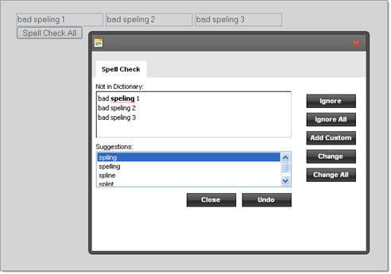

# Spellchecking Multiple Text Areas


## Scenario

How to spell-check multiple text-areas at once using a custom text source.

## Solution

To spell check multiple text sources:

* Define a [Custom Text Source]() that accepts a single "sources" parameter. The parameter will accept an array of element text that will be passed to it.

* In the get_text() method for the custom text source, get the text from each control and join these strings with separators to make a single string.

* In the set_text() method parse the "text" property and use the parts to populate the "sources" array.

* Create an array of HtmlElementTextSource that in turn takes the contents of each textbox in the constructor.

* Create an instance of your new custom text source object, passing the array of HtmlElementTextSource in the constructor.

* Call the RadSpell client object set_textSource() method, passing the new custom text source object instance.

>note HtmlElementTextSource is defined in the Telerik.Web.UI.Spell assembly, and registered for availability to JavaScript within RadSpell.js. RadSpell.js is normally a resource and not visible to you, but you can find the JavaScript source in the Telerik UI for ASP.NET AJAX installation directory under "\scripts".
>


This general approach can be used not just for TextBoxes, but for spell checking any combination of controls on a web page.

>note At runtime the joined string might look like:
>"bad spelling 1<controlSeparator><br/></controlSeparator>bad spelling 2<controlSeparator><br/></controlSeparator>bad spelling 3"
>But is displayed as in __Figure 1__ .
>The "<controlSeparator>" tags are arbitrary and can be any unique string that is used to join in the get_text() method and parse back apart in the set_text() method. The "<br> tags are necessary to show each misspelling on a separate line in the "Not in Dictionary' section of the dialog.
>

>caption Figure 1: Errors shown from multiple text areas without the </controlSeparator> keyword



````JavaScript
	<telerik:RadCodeBlock ID="RadCodeBlock1" runat="server">
	   <script type="text/javascript">
	       function MultipleTextSource(sources)
	       {
	         this.sources = sources;
	         this.get_text = function()
	         {
	            var texts = [];
	            for (var i = 0; i < this.sources.length; i++)
	            {
	               texts[texts.length] = this.sources[i].get_text();
	            }
	            return texts.join("<controlSeparator><br/></controlSeparator>");
	         }
	         this.set_text = function(text)
	         {
	            var texts = text.split("<controlSeparator><br/></controlSeparator>");
	            for (var i = 0; i < this.sources.length; i++)
	            {
	               this.sources[i].set_text(texts[i]);
	            }
	         }
	       }
	       function spellCheck()
	       {    
	           var sources =
	               [
	               new Telerik.Web.UI.Spell.HtmlElementTextSource($get('TextBox1')),
	               new Telerik.Web.UI.Spell.HtmlElementTextSource($get('TextBox2')),
	               new Telerik.Web.UI.Spell.HtmlElementTextSource($get('TextBox3'))
	               ];
	           var spell = $find('<%= RadSpell1.ClientID %>');
	           spell.set_textSource(new MultipleTextSource(sources));
	           spell.startSpellCheck();
	       }
	   </script>
	</telerik:RadCodeBlock> 
````


````ASPNET
	<asp:ScriptManager ID="Scriptmanager1" runat="server">
	</asp:ScriptManager>
	<asp:TextBox ID="TextBox1" runat="server"></asp:TextBox>
	<asp:TextBox ID="TextBox2" runat="server"></asp:TextBox>
	<asp:TextBox ID="TextBox3" runat="server"></asp:TextBox>
	<telerik:RadSpell ID="RadSpell1" runat="server" ButtonType="None" />
	<input id="Button1" type="button" value="Spell Check All" onclick="spellCheck();" /> 
````


