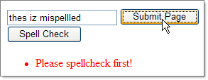

# SpellCheckValidator

**SpellCheckValidator** validates a form based on a **RadSpell** control. It can be used to enforce spell checking before form submission. The **ControlToValidate** must be set to the ID of a RadSpell control. The RadSpell control should be separately set up with a control to check and other options.

SpellCheckValidator descends from [CustomValidator](https://msdn2.microsoft.com/en-us/library/system.web.ui.webcontrols.customvalidator(VS.71).aspx) and ultimately [BaseValidator](https://msdn2.microsoft.com/en-us/library/system.web.ui.webcontrols.basevalidator(VS.71).aspx) and so shares behavior and properties with the other ASP.NET Standard validation controls.

The following below demonstrates spell checking a standard TextBox when the page is submitted.

>caution The example requires that you spell check the entry, even if none of the words are misspelled.



````ASP.NET
<asp:TextBox ID="TextBox1" runat="server">thes iz mispellled</asp:TextBox>
<telerik:SpellCheckValidator ID="SpellCheckValidator1" runat="server" ControlToValidate="RadSpell1"
   ErrorMessage="Please spellcheck first!" Display="Dynamic"></telerik:SpellCheckValidator>
<asp:Button ID="Button1" runat="server" Text="Submit Page" OnClick="Button1_Click" />
<telerik:RadSpell RenderMode="Lightweight" ID="RadSpell1" runat="server" ButtonType="PushButton" ControlToCheck="TextBox1" />
<br />
<asp:ValidationSummary ID="ValidationSummary1" runat="server" /> 
````


