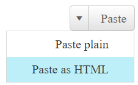

# Right-to-Left Support


The **RadSplitButton** fully supports right-to-left (RTL) language locales (**Figure 1**).In order to turn on the RTL support you should set **dir=rtl to the html or body** element or at least to its parent element (**Figure 1**). You can also use the **direction:rtl** CSS property.

>caption Figure 1: RadSplitButton in RTL mode.



>caption Example 1: Set the dir=rtl attribute to the **RadSplitButton**'s wrapper element in order to enable the RTL support for the control.

````ASP.NET
<div dir="rtl">
    <telerik:RadSplitButton runat="server" AutoPostBack="true" ID="RadSplitButton1" Skin="Silk" Text="Paste" CommandName="Paste">
        <ContextMenu>
            <Items>
                <telerik:RadMenuItem Text="Paste plain" Value="PastePlain"></telerik:RadMenuItem>
                <telerik:RadMenuItem Text="Paste as HTML" Value="PasteHtml"></telerik:RadMenuItem>
            </Items>
        </ContextMenu>
    </telerik:RadSplitButton>
</div>
````

## See Also

 * [See this live in an online demo](https://demos.telerik.com/aspnet-ajax/splitbutton/right-to-left-support/defaultcs.aspx)

 * [WCAG 2.0 and Section 508 Accessibility Compliance]()

 * [Keyboard Support]()

