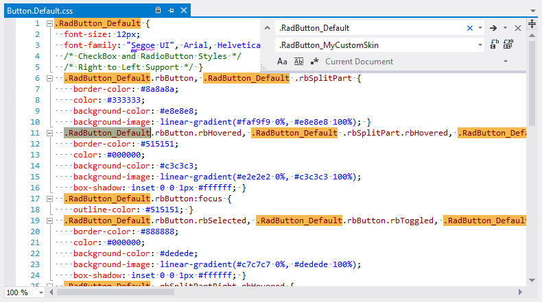

# Create a Custom Skin

Each of the controls included in the **Telerik® UI for ASP.NET AJAX** suite is styled with two CSS files that are loaded in a certain order. The first file – **[ControlName].css** , also called base stylesheet, contains CSS properties and values that are common for all skins, i.e., it is layout-specific, not skin-specific. These are CSS float, padding, margin, font-size, font-family, etc. In general, when creating a custom skin for a control, this file should not be edited unless the custom skin needs different sizes, padding and / or margins.

The second file represents the actual skin of the control, and its name consists of the control name plus the skin name, e.g., - **Button.Default.css**. Upon creating a custom skin for the control, one should edit that particular file, as it contains skin-specific CSS properties and references to images, colors, borders and backgrounds.

## Create a RadSplitButton Skin from an Existing One

1. In your project, create a new directory named **Skins**;

1. In the **Skins** folder if you already have some custom skin, most probably you have already a folder named: **MyCustomSkin** – if you don’t – create one;

1. In the **Skins** folder, create a new folder named: **MyCustomSkinLite** - this is the place where your Lightweight custom skins CSS will be placed; 

1. Go to **[ControlsInstallationFolder]\Skins\DefaultLite** and copy **Button.Default.css** and **Menu.Default.css** into your **MyCustomSkinLite** folder;

1. Go to **[TelerikControlsInstallationFolder]\Skins\Default** and copy the **Common** folder into your **MyCustomSkin** folder;

1. Rename **Button.Default.css** to **Button.MyCustomSkin.css** and **Menu.Default.css** to **Menu.MyCustomSkin.css**;

1. When you are finished you should have the following folder structure in your project:

	1. **Skins/MyCustomSkin/Common/** - containing several sprites;

	1. **Skins/MyCustomSkinLite/Button.MyCustomSkin.css**.

	1. **Skins/MyCustomSkinLite/Menu.MyCustomSkin.css**.

1. In order to support multiple skins of **RadSplitButton** on a single page, the wrapping skin-specific class is created by the name of the control, plus underscore ("_") plus SkinName, i.e., **.RadButton_Default**, so in order to create a custom skin out of the Default skin, we should rename all occurrences of **"RadButton_Default"** in **Button.MyCustomSkin.css** to **"RadButton_MyCustomSkin"** as shown below and **"RadMenu_Default"** in **Menu.MyCustomSkin.css** to **"RadMenu_MyCustomSkin"** in the same manner.

	

1. Add a new server declaration of **RadSplitButton** on your page, and set **Skin="MyCustomSkin"** and **EnableEmbeddedSkins="false"**:

	**ASP.NET**

		<telerik:RadSplitButton ID="RadSplitButton1" runat="server" EnableEmbeddedSkins="false" Skin="MyCustomSkin" />

1. Register **Button.MyCustomSkin.css** and **Menu.MyCustomSkin.css** in the head section of your web page. In order to have the CSS applied correctly, the base stylesheet should come first in the DOM:

	**ASP.NET**

		<link href="Skins/MyCustomSkin/Button.MyCustomSkin.css" rel="stylesheet" type="text/css" />
		<link href="Skins/MyCustomSkin/Menu.MyCustomSkin.css" rel="stylesheet" type="text/css" />

1. Make sure the path to the files is correct; otherwise the skin will not apply;

1. Reload the page, and if the steps above have been followed correctly, you will see **RadSplitButton** running a custom Default skin set as an external resource.

## Custom Skin Example

The example below shows how to modify the CSS in order not only to change some colors and background colors, but also some base layout settings such as font size, element height, border-radius, etc.

````ASPX
<asp:ScriptManager runat="server"></asp:ScriptManager>
<telerik:RadSplitButton runat="server" Text="SplitButton">
    <ContextMenu>
        <Items>
            <telerik:RadMenuItem Text="Action1"></telerik:RadMenuItem>
            <telerik:RadMenuItem Text="Action2"></telerik:RadMenuItem>
            <telerik:RadMenuItem Text="Action3"></telerik:RadMenuItem>
        </Items>
    </ContextMenu>
</telerik:RadSplitButton>
````
````CSS
/* Button normal state */
.RadButton.RadButton_Default.rbButton,
.RadButton.RadButton_Default.rbButton .rbSplitPart {
    background-color: #80078e;
    background-image: linear-gradient(#4f0258, #80078e 100%);
    border-color: #6b536e;
    color: #fff;
}

    /* Button hovered state */
    .RadButton.RadButton_Default.rbButton.rbHovered,
    .RadButton.RadButton_Default.rbButton .rbSplitPart.rbHovered {
        background-color: #660283;
        background-image: linear-gradient(#660283, #f2ddf8 100%);
        border-color: #47035a;
        color: #3a0470;
    }

/* ContextMenu normal state */
.RadMenu.RadMenu_Default .rmGroup {
    border-color: #6b536e;
    color: #fff;
    background-color: #80078e;
}
    .RadMenu.RadMenu_Default .rmGroup:before {
        border-color: transparent;
        background-color: #80078e;
    }
            
    /* ContextMenu hovered state */
    .RadMenu.RadMenu_Default .rmGroup .rmLink:hover {
        background-color: #660283;
        background-image: linear-gradient(#660283, #f2ddf8 100%);
        border-color: #47035a;
        color: #3a0470;
    }
````

## See Also

 * [Render Modes]()
