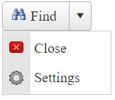
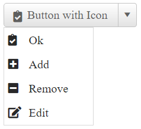

# Custom Icons

This help article shows how to use custom icons (images or font icons) in **RadSplitButton**.

* [Image Icons](#image-icons)

* [Font Icons](#font-icons)

## Image Icons

To display an image icon on the splitbutton, you need to set the **Icon.Url** property to point to the URL of the desired image. In the ContextMenu Items, Images can be added as described in the [Adding Images to Items]() article.



````ASPX
<telerik:RadSplitButton ID="RadSplitButton2" runat="server" Text="Button With Custom Image Icon">
    <Icon Url="https://demos.telerik.com/aspnet-ajax/button/examples/customicons/images/eFind.png" />
    <ContextMenu>
        <Items>
            <telerik:RadMenuItem Text="Action1" ImageUrl="https://demos.telerik.com/aspnet-ajax/button/examples/customicons/images/eClose.png"></telerik:RadMenuItem>
            <telerik:RadMenuItem Text="Action2" ImageUrl="https://demos.telerik.com/aspnet-ajax/button/examples/customicons/images/eTools.png"></telerik:RadMenuItem>
        </Items>
    </ContextMenu>
</telerik:RadSplitButton>
````

### Hovered and Active States

**RadSplitButton** also provides an easy way to show different icon when the mouse is over the Button, or the button is pressed. To do this, use the `HoveredCssClass` and `PressedCssClass` properties exposed by the **Icon** tag. The same is valid for the Items in the embedded context menu with the help of `ImageUrl`, `HoveredImageUrl`, `ImageClickedUrl` properties as explained in the [Adding Images to Items]() article.

## Font Icons

You can use custom font icons in **RadSplitButton** as well. To do that, follow the steps below:

1. Load the stylesheet with the desired font icons on the page.

	**CSS**
		<link rel="stylesheet" href="myCustomFontStyleSheet.css" />

1. Override the font-family of the button's icon element with the target one.

	**CSS**
		.RadSplitButton .rbIcon.rbPrimaryIcon:before,
		.RadMenu_Context .rmItem .rmLeftImage:before{
			font-family: myCustomFont;
		}

1. Set the custom font icon class to the **Icon.CssClass** property.

	**ASP.NET**

		<telerik:RadSplitButton ID="RadSplitButton1" runat="server" Text="Button With Custom Font Icon">
			<Icon CssClass="myCustomFontIconClass" />
		</telerik:RadPushButton>

		<telerik:RadSplitButton ID="RadSplitButton1" runat="server" Text="Button with Icon">
			<Icon CssClass="myCustomFontIconClass" />
			<ContextMenu>
				<Items>
					<telerik:RadMenuItem Text="Action 1" EnableImageSprite="true" SpriteCssClass="myCustomFontIconClass"></telerik:RadMenuItem>
					<telerik:RadMenuItem Text="Action 2" EnableImageSprite="true" SpriteCssClass="myCustomFontIconClass"></telerik:RadMenuItem>
				</Items>
			</ContextMenu>
		</telerik:RadSplitButton>

Sample of SplitButton with FontAwesome icons:



Below is the code for achieving this appearance:

````ASPX
<style>
    .RadButton .rbIcon.rbPrimaryIcon::before,
    .RadMenu_Context .rmItem .rmLeftImage:before {
        font-family: "Font Awesome 5 Free";
        font-weight: 900;
    }
</style>
<telerik:RadSplitButton ID="RadSplitButton1" runat="server" Text="Button with Icon" Skin="Silk">
    <Icon CssClass="fas fa-clipboard-check" />
    <ContextMenu>
        <Items>
            <telerik:RadMenuItem Text="Ok" EnableImageSprite="true" SpriteCssClass="fas fa-clipboard-check"></telerik:RadMenuItem>
            <telerik:RadMenuItem Text="Add" EnableImageSprite="true" SpriteCssClass="fas fa-plus-square"></telerik:RadMenuItem>
            <telerik:RadMenuItem Text="Remove" EnableImageSprite="true" SpriteCssClass="fas fa-minus-square"></telerik:RadMenuItem>
            <telerik:RadMenuItem Text="Edit" EnableImageSprite="true" SpriteCssClass="fas fa-edit"></telerik:RadMenuItem>
        </Items>
    </ContextMenu>
</telerik:RadSplitButton>
````

You can also change the font-size and color of the font icon as described in the [Fine Tune]() help article.

Check out how to use Font Awesome icons along with Telerik controls in the [4 Ways to Embed Font Awesome in Telerik UI for ASP.NET AJAX Controls](https://www.telerik.com/blogs/4-ways-embed-font-awesome-telerik-ui-for-asp-dotnet-ajax) blog post.

## See Also

 * [Icons](https://demos.telerik.com/aspnet-ajax/splitbutton/functionality/icons/defaultcs.aspx)
 
 * [Icons Overview]()
 
 * [Fine Tune Icons Position, Size and Color]()
 
 
