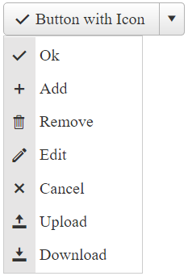
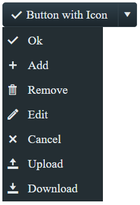

# Embedded Icons

This help article shows how to use embedded icons in **RadSplitButton**, lists the necessary CSS classes and describes the skins specifics.

* [Configuration](#configuration)

* [CssClass List of Embedded Icons](#cssclass-list-of-embedded-icons)

* [Skins Specifics](#skins-specifics)



You can also use [custom icons]() (image or font icons) and [fine-tune their position, color and size]().

For live example of how SplitButton works with Icons check out our demo - [Icons](https://demos.telerik.com/aspnet-ajax/splitbutton/functionality/icons/defaultcs.aspx)

## Configuration

To make the control easier to use, **Telerik** provides a large set of built-in icons. To use them, set the **Icon.CssClass** property (**Example 1**) to one of the predefined [CSS class names](#cssclass-list-of-embedded-icons), and the respective icon will be shown inside the Button part of the control.

To use built-in icons in the ContextMenu options of the SplitButton, enable the `EnableImageSprite` property of the corresponding MenuItem and set the icon class in the `SpriteCssClass` preceded with the "p-icon" class name.

Declaration of SplitButton shown in the image above:

````ASPX
<telerik:RadSplitButton ID="RadSplitButton1" runat="server" Text="Button with Icon">
    <Icon CssClass="rbOk" />
    <ContextMenu>
        <Items>
            <telerik:RadMenuItem Text="Ok" EnableImageSprite="true" SpriteCssClass="p-icon rbOk"></telerik:RadMenuItem>
            <telerik:RadMenuItem Text="Add" EnableImageSprite="true" SpriteCssClass="p-icon rbAdd"></telerik:RadMenuItem>
            <telerik:RadMenuItem Text="Remove" EnableImageSprite="true" SpriteCssClass="p-icon rbRemove"></telerik:RadMenuItem>
            <telerik:RadMenuItem Text="Edit" EnableImageSprite="true" SpriteCssClass="p-icon rbEdit"></telerik:RadMenuItem>
            <telerik:RadMenuItem Text="Cancel" EnableImageSprite="true" SpriteCssClass="p-icon rbCancel"></telerik:RadMenuItem>
            <telerik:RadMenuItem Text="Upload" EnableImageSprite="true" SpriteCssClass="p-icon rbUpload"></telerik:RadMenuItem>
            <telerik:RadMenuItem Text="Download" EnableImageSprite="true" SpriteCssClass="p-icon rbDownload"></telerik:RadMenuItem>
        </Items>
    </ContextMenu>
</telerik:RadSplitButton>
````

## CssClass List of Embedded Icons

You can find below the full list of CSS classes responsible for the embedded icons in **RadSplitButton**. The **CssClass** is composed in the following way: [**r**]ad[**b**]utton[**IconName**]. For example **rbAdd**.

|  |  |  |  |  |
| ------ | ------ | ------ | ------ | ------ |
|rbAdd|rbPrevious|rbPrint|rbRSS|rbYouTube |
|rbRemove|rbNext|rbRefresh|rbMail|rbVimeo |
|rbOk|rbOpen|rbSearch|rbFB|rbBehance |
|rbCancel|rbAttach|rbHelp|rbTwitter|rbDribble |
|rbUpload|rbSave|rbCart|rbLinkedIn |rbGooglePlus|
|rbDownload|rbConfig|rbEdit|rbPinterest||


## Skins Specifics

The color of the predefined icons can be white or black, depending on the chosen Skin. See how the icons look like in **Glow** Skin below:




## See Also

 * [Icons](https://demos.telerik.com/aspnet-ajax/splitbutton/functionality/icons/defaultcs.aspx)

 * [Fine-tune Icons]()
 
 * [Custom Icons]()

