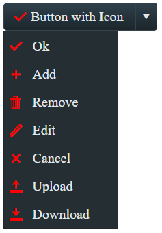

# Fine-tune Icons

This help article shows how to modify the position, size and color of icons in **RadSplitButton**.

* [Fine-tune Position](#fine-tune-position)

* [Configure Font-size and Color](#configure-font-size-and-color)

## Fine-tune Position

You can change the position of font or image icons to match your concrete requirements. To do this, use the `Icon.Top` and `Icon.Left` properties to directly offset the icon:

````ASP.NET
<telerik:RadSplitButton ID="RadSplitButton1" runat="server" Text="Fine Tune Icon Position" Height="40px">
	<Icon CssClass="rbRefresh"
		Top="12px" Left="7px" />
</telerik:RadSplitButton>
````

## Configure Font-size and Color

The embedded **RadSplitButton** icons are font icons. Using a font facilitates the customization of the icons. For example, you can change the icons color and font size with a single line of CSS (see **Figure 2** and **Example 2**).

>caption Figure 2: Customize the font size and color of the embedded icons of RadPushButton with CSS.



>caption Example 2: Use CSS to modify the font size and color of the embedded icons in RadSplitButton.

````CSS
.RadSplitButton.customButton .rbPrimaryIcon:before,
.RadMenu_Context.customMenu .rmItem .rmLeftImage:before {
    color: red;
    font-size: 17px;
}
````

````ASPX
<telerik:RadSplitButton ID="RadSplitButton1" runat="server" Text="Button with Icon" CssClass="customButton" Skin="Glow">
    <Icon CssClass="rbOk" />
    <ContextMenu CssClass="customMenu">
        <Items>
            <telerik:RadMenuItem Text="Ok" EnableImageSprite="true" SpriteCssClass="p-icon rbOk"></telerik:RadMenuItem>
            <telerik:RadMenuItem Text="Add" EnableImageSprite="true" SpriteCssClass="p-icon rbAdd"></telerik:RadMenuItem>
            <telerik:RadMenuItem Text="Remove" EnableImageSprite="true" SpriteCssClass="p-icon rbRemove"></telerik:RadMenuItem>
            <telerik:RadMenuItem Text="Edit" EnableImageSprite="true" SpriteCssClass="p-icon rbEdit"></telerik:RadMenuItem>
            <telerik:RadMenuItem Text="Cancel" EnableImageSprite="true" SpriteCssClass="p-icon rbCancel"></telerik:RadMenuItem>
            <telerik:RadMenuItem Text="Upload" EnableImageSprite="true" SpriteCssClass="p-icon rbUpload"></telerik:RadMenuItem>
            <telerik:RadMenuItem Text="Download" EnableImageSprite="true" SpriteCssClass="p-icon rbDownload"></telerik:RadMenuItem>
        </Items>
    </ContextMenu>
</telerik:RadSplitButton>
````

>tip This also applies for [custom font icons](#font-icons).

## See Also
 
 * [Icons](https://demos.telerik.com/aspnet-ajax/splitbutton/functionality/icons/defaultcs.aspx)

 * [Icons Overview]()

 * [Custom Icons]()
 

