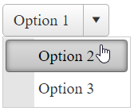
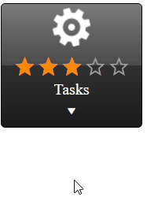

# ContentTemplate

This help article showcases how to add complex content (server-side controls and HTML elements) in **RadSplitButton** instead of plain text.

## Default Template

The default appearance and behavior of the **SplitButton** Control can be replicated with the template declaration shown below. The same code can serve as a convenient basis for further modifications and customizing the output.

````ASPX
<telerik:RadSplitButton runat="server" ID="RadSplitButton1" Text="option1" PersistChangesFromContextMenu="true" CommandName="DoSomething">
    <ContentTemplate>
        <span class="rbSplitPart rbSplitPartRight" onclick="splitPartClick(this,event);"><span class="rbIcon p-icon rbSplitIcon p-i-arrow-down"></span></span>
        <asp:Label Text='<%# Container.Text %>' CssClass="rbText" ID="Label1" runat="server" />
    </ContentTemplate>
    <ContextMenu>
        <Items>
            <telerik:RadMenuItem Text="option2" Value="DoSomething2"></telerik:RadMenuItem>
            <telerik:RadMenuItem Text="option3" Value="DoSomething3"></telerik:RadMenuItem>
        </Items>
    </ContextMenu>
</telerik:RadSplitButton>
<script>
    function splitPartClick(splitPart,ev) {
        ev.preventDefault();
        ev.stopPropagation();
        var splitButton = splitPart.closest('.RadSplitButton').control;
        splitButton.openContextMenu(true);
    }
</script>
````

````C#
protected void Page_PreRenderComplete(object sender, EventArgs e)
{
    RadSplitButton1.DataBind();
}
````
````VB
protected Sub Page_PreRenderComplete(ByVal sender As Object, ByVal e As EventArgs) Handles Me.PreRenderComplete
    RadSplitButton1.DataBind()
End Sub
````

The result from the declaration above:



>note In the sample above Text of the RadSplitButton is applied to the embedded Label via server binding expression. Therefore we need to call the DataBind() method for the RadSplitButton in a late enough stage of the Page Lifecycle for the ViewState to be properly persisted.

## Custom Template

In order to add controls to the **RadSplitButton** in the markup, you should place them directly in the composite **ContentTemplate** property.

Sample:



Below is the SplitButton declaration for achieving this appearance:

````ASPX
<telerik:RadSplitButton runat="server" ID="RadSplitButton1" Text="Option 1" CommandName="Command1" PersistChangesFromContextMenu="false" Skin="Black">
    <ContentTemplate>
            
            <telerik:RadRating RenderMode="Lightweight" ID="RadRating1" runat="server" Enabled="false" Value="3" SelectionMode="Continuous" ItemCount="5" />
            <div>Tasks</div>
        <div onclick="splitPartClick(this,event);"><span class="rbIcon p-icon rbSplitIcon p-i-arrow-down"></span></div>
    </ContentTemplate>
    <ContextMenu>
        <Items>
            <telerik:RadMenuItem Text="Task 1" Value="Command2"></telerik:RadMenuItem>
            <telerik:RadMenuItem Text="Task 2" Value="Command3"></telerik:RadMenuItem>
        </Items>
    </ContextMenu>
</telerik:RadSplitButton>
<script>
    function splitPartClick(splitPart,ev) {
        ev.preventDefault();
        ev.stopPropagation();
        var splitButton = splitPart.closest('.RadSplitButton').control;
        splitButton.openContextMenu(true);
    }
</script>
````

You can further extend the appearance customization by using Templates inside the embedded ContextMenu. Find details about using Templates in RadMenu here - [RadMenu Templates]()

## See Also

 * [ContentTemplate Demo](https://demos.telerik.com/aspnet-ajax/splitbutton/functionality/content-template/defaultcs.aspx)

 * [Icons]()

 * [Embedded Context Menu]()

 * [Single-Click]()

