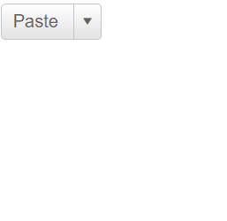
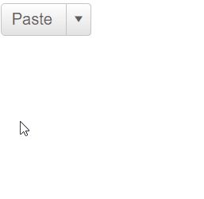
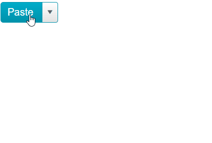
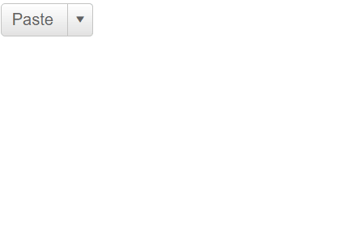

# Embedded Context Menu

The embedded **RadContextMenu** in the **RadSplitButton** is the control that contains a set of all possible actions that the SplitButton can trigger.

You can define and customize the Context Menu via the `<ContextMenu>` inner tag.

The main idea of the SplitButton control is to let the user chose between multiple different commands and execute just the desired one on a click.

## Default Button

The default command and text of the SplitButton are defined by setting the `Text`, `CommandName` and `CommandArgument` properties of the **RadSplitButton** either in its declaration or programmatically in the code-behind:

````ASPX
<telerik:RadSplitButton runat="server" ID="RadSplitButton1" Text="Sort by Name" CommandName="sortByName" CommandArgument="MyArgument">
    <ContextMenu>
        ....
    </ContextMenu>
</telerik:RadSplitButton>
````

## List of Button Commands

To define the set of various Button Commands for the **RadSplitButton** it is enough to declare **RadMenuItem**(s) in the the embedded ContextMenu:

````ASPX
<telerik:RadSplitButton runat="server" ID="RadSplitButton1" Text="Sort by Name" CommandName="sortByName" CommandArgument="MyArgument">
    <ContextMenu>
        <Items>
            <telerik:RadMenuItem Text="Sort by Name" Value="sortByName">
            </telerik:RadMenuItem>
            <telerik:RadMenuItem Text="Sort by Type" Value="sortByType">
            </telerik:RadMenuItem>
            <telerik:RadMenuItem Text="Sort by Size" Value="sortBySize">
            </telerik:RadMenuItem>
        </Items>
    </ContextMenu>
</telerik:RadSplitButton>
````

By default the `Value` of each **RadMenuItem** acts as a separate `CommandName` for the **SplitButton** that will be processed upon clicking the Item. 

>note This behavior can be changed/extended with the help of the [OnClientContextMenuItemClicked event]().

## Persisting ContextMenu selection

**RadSplitButton** exposes the `PersistChangesFromContextMenu` property that controls wether the `Text` of a clicked Context's MenuItem should become a `Text` for the **RadSplitButton** and the `Value` of the MenuItem should be set button's `CommandName`.

See how the `PersistChangesFromContextMenu` affects the behavior of the control:

>caption PersistChangesFromContextMenu="true" (Default)



>caption PersistChangesFromContextMenu="false"



Here is the sample declaration we used for the two examples above:

````ASPX
<telerik:RadSplitButton runat="server" AutoPostBack="true" ID="RadSplitButton1" Text="Paste" PersistChangesFromContextMenu="false" CommandName="Paste" OnCommand="RadSplitButton1_Command" Skin="Silk">
    <ContextMenu>
        <Items>
            <telerik:RadMenuItem Text="Paste" Value="Paste"></telerik:RadMenuItem>
            <telerik:RadMenuItem Text="Paste as Plain Text" Value="PastePlainText"></telerik:RadMenuItem>
            <telerik:RadMenuItem Text="Paste as HTML" Value="PasteHtml"></telerik:RadMenuItem>
        </Items>
    </ContextMenu>
</telerik:RadSplitButton>
<br />
<asp:Label Text="" ID="Label1" runat="server" />
````

````C#
protected void RadSplitButton1_Command(object sender, CommandEventArgs e)
{
    var commandName = e.CommandName;
    Label1.Text += String.Format("<br />Command: <b>{0}</b>;", commandName);
}
````
````VB
Protected Sub RadSplitButton1_Command(ByVal sender As Object, ByVal e As CommandEventArgs)
    Dim commandName = e.CommandName
    Label1.Text &= String.Format("<br />Command: <b>{0}</b>;", commandName)
End Sub
````

## Using And Persisting Custom Item Attributes

The embedded ContextMenu in RadSplitButton can handle custom attributes as described in the [RadMenu Custom Attributes]() article.

Within the [OnClientContextMenuItemClicked event]() we can pass custom attributes as different CommandName and CommandArgument upon clicking each MenuItem.

For instance:

````ASPX
<telerik:RadSplitButton runat="server" ID="RadSplitButton1" Text="Paste"
    CommandName="Paste" CommandArgument="Default Argument"
    OnClientContextMenuItemClicked="OnClientContextMenuItemClicked"
    OnCommand="RadSplitButton1_Command" Skin="Silk">
    <ContextMenu>
        <Items>
            <telerik:RadMenuItem Text="Paste" CommandName="Paste" CommandArgument="Custom Argument 1"></telerik:RadMenuItem>
            <telerik:RadMenuItem Text="Paste as Plain Text" CommandName="PastePlainText" CommandArgument="Custom Argument 2"></telerik:RadMenuItem>
            <telerik:RadMenuItem Text="Paste as HTML" CommandName="PasteHtml" CommandArgument="Custom Argument 3"></telerik:RadMenuItem>
        </Items>
    </ContextMenu>
</telerik:RadSplitButton>
<br />
<asp:Label Text="" ID="Label1" runat="server" />
````

````JavaScript
function OnClientContextMenuItemClicked(sender, args) {
    var item = args.get_item();
    //get the custom attributes (CommandName and CommandArgument) set to the items
    var itemCommandName = item.get_attributes().getAttribute("CommandName");
    var itemCommandArg = item.get_attributes().getAttribute("CommandArgument");
    args.set_newCommandName(itemCommandName);
    args.set_newCommandArgument(itemCommandArg);
}
````

````C#
protected void RadSplitButton1_Command(object sender, CommandEventArgs e)
{
    var commandName = e.CommandName;
    var commandArgument = e.CommandArgument;
    Label1.Text += String.Format("<br />CommandName: <b>{0}</b>;<br />CommandArgument: <b>{1}</b>", commandName, commandArgument);
}
````
````VB
Protected Sub RadSplitButton1_Command(ByVal sender As Object, ByVal e As CommandEventArgs)
    Dim commandName = e.CommandName
    Dim commandArgument = e.CommandArgument
    Label1.Text &= String.Format("<br />CommandName: <b>{0}</b>;<br />CommandArgument: <b>{1}</b>", commandName, commandArgument)
End Sub
````

The result behavior will be different depending on the value set to the `PersistChangesFromContextMenu` property of the RadSplitButton:

>caption PersistChangesFromContextMenu="true" (Default)



>caption PersistChangesFromContextMenu="false"



## DataBinding

The RadContextMenu embedded in RadSplitButton is a fully functional Menu having the same properties, methods, and events like the [RadMenu](). Similar to the RadMenu the Context menu in the SplitButton can be bound to various types of data sources.

All the properties related to the context menu binding are accessible in the markup within the `<ContextMenu>` inner tag and in the code-behind via the `[RadSplitButton].ContextMenu` property.

To get a better understanding of how to bind set of actions to the RadSplitButton's ContextMenu check out the dedicated live demos:

 - [Declarative DataSources](https://demos.telerik.com/aspnet-ajax/splitbutton/data-binding/declarative-binding/defaultcs.aspx)

 - [Programmatic Binding](https://demos.telerik.com/aspnet-ajax/splitbutton/data-binding/programmatic-binding/defaultcs.aspx)

 - [Binding to Telerik ClientDataSource](https://demos.telerik.com/aspnet-ajax/splitbutton/data-binding/client-side-data-binding/defaultcs.aspx)

More details about binding a menu you can find in the [DataBinding section of RadMenu documentation](). 

Sample of basic binding within RadSplitButton:

````ASPX
<telerik:RadSplitButton runat="server" ID="RadSplitButton1" Text="SplitButton">
    <ContextMenu OnDataBinding="SplitButtonContextMenu_DataBinding"
        DataTextField="Text"
        DataValueField="Command">
    </ContextMenu>
</telerik:RadSplitButton>
````

````C#
protected void Page_Load(object sender, EventArgs e)
{
    if (!IsPostBack)
    {
        RadSplitButton1.ContextMenu.DataBind();
    }
}

protected void SplitButtonContextMenu_DataBinding(object sender, EventArgs e)
{
    var contextMenu = sender as RadContextMenu;
    contextMenu.DataSource = new object[] {
        new {Text = "Action 1", Command = "Command 1"},
        new {Text = "Action 2", Command = "Command 2"},
        new {Text = "Action 3", Command = "Command 3"},
        new {Text = "Action 4", Command = "Command 4"},
    };
}
````
````VB
Protected Sub Page_Load(ByVal sender As Object, ByVal e As EventArgs)
    If Not IsPostBack Then
        RadSplitButton1.ContextMenu.DataBind()
    End If
End Sub

Protected Sub SplitButtonContextMenu_DataBinding(ByVal sender As Object, ByVal e As EventArgs)
    Dim contextMenu = TryCast(sender, RadContextMenu)
    contextMenu.DataSource = New Object() {New With {Key
        .Text = "Action 1", Key
        .Command = "Command 1"
    }, New With {Key
        .Text = "Action 2", Key
        .Command = "Command 2"  
    }, New With {Key
        .Text = "Action 3", Key
        .Command = "Command 3"
    }, New With {Key
        .Text = "Action 4", Key
        .Command = "Command 4"
    }}
End Sub
````

## See Also

 * [Data Binding Demo](https://demos.telerik.com/aspnet-ajax/splitbutton/data-binding/programmatic-binding/defaultcs.aspx)

 * [Icons]()

 * [Content Template]()
 
 * [Single-Click]()