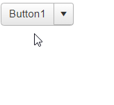

# Single Click

RadSplitButton similar to the [RadPushButton](), also exposes the `SingleClick` property.

The single click button (**Figure 1**) is used to avoid multiple postbacks to the server. This feature is useful in scenarios when the developer should prevent submitting of identical content multiple times to the server.

>caption Figure 1: RadSplitButton with SingeClick functionality before and after click.



The following properties should be used to enable the single click functionality:

* `SingleClick` - determines whether the **RadSpitButton** control will be immediately disabled after the user clicks it. Set it to **true** to enable the single click functionality.

* `SingleClickText` - determines the text displayed in the **RadSpitButton** control after the button is being clicked and disabled. The original text will be retrieved after the server request execution. The property takes a plain text string.

>caption Example 1: The code that enables the single click functionality in **RadSplitButton** from **Figure 1**.

````ASPX
<telerik:RadSplitButton runat="server" ID="RadSplitButton1" Text="Button1"  SingleClick="true" SingleClickText="Processing..." OnClick="RadSplitButton1_Click" >
    <ContextMenu>
        <Items>
            <telerik:RadMenuItem Text="Button1"></telerik:RadMenuItem>
            <telerik:RadMenuItem Text="Button2"></telerik:RadMenuItem>
            <telerik:RadMenuItem Text="Button3"></telerik:RadMenuItem>
        </Items>
    </ContextMenu>
</telerik:RadSplitButton>
````

````C#
protected void RadSplitButton1_Click(object sender, EventArgs e)
{
    //imitate time consuming server request, so that the disabled button can be examined after clicking it
    System.Threading.Thread.Sleep(1000);
}
````
````VB
Protected Sub RadSplitButton1_Click(sender As Object, e As System.EventArgs) Handles RadSplitButton1.Click
    'imitate time consuming server request, so that the disabled button can be examined after clicking it
    System.Threading.Thread.Sleep(1000)
End Sub
````


## See Also

 * [Single-click Demo](https://demos.telerik.com/aspnet-ajax/splitbutton/functionality/single-click/defaultcs.aspx)

 * [Icons]()

 * [Embedded Context Menu]()

 * [Content Template]()
 

