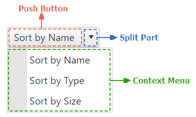

# Getting Started

The following article shows the structure and demonstrates how you can add the RadSplitButton control and customize it by setting some of its properties.

## Structure

The **RadSplitButton** is essentially a [RadPushButton](), functionally expanded with a [RadContextMenu]() holding the set of alternative button options.



To find more about the embedded components of the SplitButton, check out the dedicated documentation sections:

 - [RadPushButton]() 

 - [RadContextMenu]()

## Add a RadSplitButton Control

To add a RadSplitButton similar to the one shown in image above, follow the steps:

 - Add a `ScriptManager` control on a Web Form.

 - Use the `<telerik:RadSplitButton>` tag to declare the SplitButton.

 - Use the `<ContextMenu>` inner tag to set the properties of the DropDown menu and define the set of different Button items in the `<Items>` tag.

````ASPX
<telerik:RadSplitButton runat="server" ID="RadSplitButton1" Text="Sort by Name" CommandName="sortByName" CommandArgument="MyArgument">
    <ContextMenu>
        <Items>
            <telerik:RadMenuItem Text="Sort by Name" Value="sortByName">
            </telerik:RadMenuItem>
            <telerik:RadMenuItem Text="Sort by Type" Value="sortByType">
            </telerik:RadMenuItem>
            <telerik:RadMenuItem Text="Sort by Size" Value="sortBySize">
            </telerik:RadMenuItem>
        </Items>
    </ContextMenu>
</telerik:RadSplitButton>
````

As a next step, you can check out the [Functionality]() of the RadSplitButton.

## See Also

 * [Server-side Programming]()
 * [First Steps with UI for ASP.NET AJAX]()
 * [RadDateRangePicker online demos](https://demos.telerik.com/aspnet-ajax/splitbutton/examples/overview/defaultcs.aspx)

