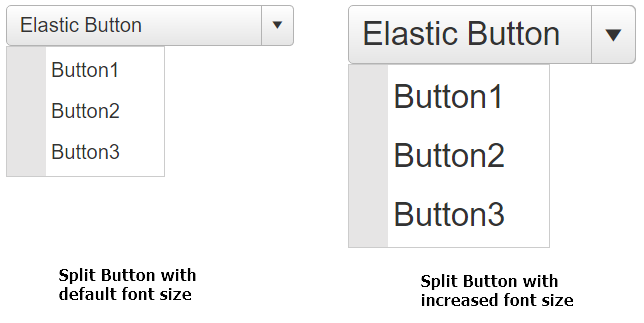

# Elastic Design

This article explains the **elastic design capabilities RadSplitButton offers**. The **Example 1** below shows the basic approaches you can use to scale the control by only changing its default font size.

@[template](/_templates/common/render-mode.md#resp-design-desc "slug-el: no, slug-fl: splitbutton/mobile-support/fluid-design")

>caption Figure 1: Comparison between appearance of a RadSplitButton with regular font size and with increased font size.




>caption How to increase the font size of a RadSplitButton as shown in Figure 1.

````CSS
body .RadButton,
body .RadMenu_Context {
    font-size: 26px;
}
    body .RadButton .rbSplitIcon {
        vertical-align: middle;
    }
    body .RadButton .rbIcon:before {
        font-size: 26px;
    }
````

````ASP.NET
<telerik:RadSplitButton runat="server" ID="RadSplitButton1" Text="Elastic Button" Width="230px">
    <ContextMenu>
        <Items>
            <telerik:RadMenuItem Text="Button1"></telerik:RadMenuItem>
            <telerik:RadMenuItem Text="Button2"></telerik:RadMenuItem>
            <telerik:RadMenuItem Text="Button3"></telerik:RadMenuItem>
        </Items>
    </ContextMenu>
</telerik:RadSplitButton>
````

## See Also

 * [Mobile Support Overview]()

 * [Render Modes]()

 * [Fluid Design]()

@[template](/_templates/common/font-size-notes.md#related-resources)
