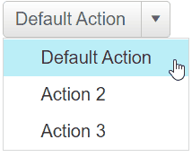

# SplitButton Overview

The **SplitButton** control is a multi-function menu button that offers a default action as well as the possibility of choosing a different action by selecting from a set of alternatives.

The **RadSplitButton** is a lightweight version of the already known **[RadButton]()** with enabled `SplitButton` functionality. In addition, the RadSplitButton exposes an embedded **[RadContextMenu]()** holding the set of alternative button options. RadSplitButton is available as of **R1 2022**.





Take the first steps with **RadSplitButton** by checking out the [Getting Started]() article.

## Key Features

 * [Built-in Accessibility, WAI-ARIA and RTL support]().

 * [Customizable embedded ContextMenu holding set of the different Button actions]().

 * [Single Click functionality - a mechanism to prevent multiple postbacks]().

 * [ContentTemplate allows using complex content inside the Button to achieve a custom look and feel of the control]().

 * [Flexible Client-Side API]().

 * [Visual Appeal - shipped with a rich set of skins for easy and consistent styling]().

## See Also

 * [Getting Started]()
 * [RadSplitButton online demos](https://demos.telerik.com/aspnet-ajax/splitbutton/overview/defaultcs.aspx)
 * [First Steps with UI for ASP.NET AJAX]() 

