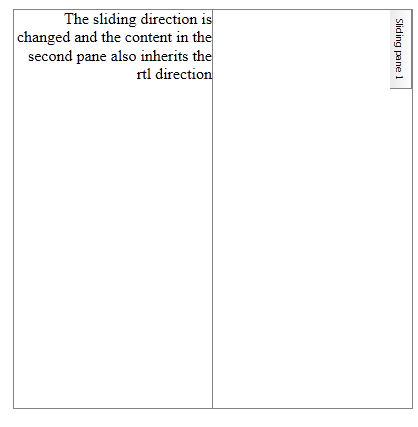

# Right-to-left Support

The **RadSplitter** fully supports right-to-left (RTL) language locales.In order to turn on the RTL support for the **RadSlidingPane** you need to set a CSS class for it forces the **text-align** property of the content to **right** in order to override the default setting from the table cell. You also need to place the **RadSplitter** in a container with **dir=rtl** or the **direction:rtl** CSS property.

````ASP.NET 
.rtlClass
{
	text-align:right;
}	
````

````ASP.NET
<telerik:RadSplitter RenderMode="Lightweight" runat="server" ID="RadSplitter1">
	<telerik:RadPane runat="server" ID="RadPane1">
		<telerik:RadSlidingZone Width="22px" ID="RadSlidingZone1" runat="server">
			<telerik:RadSlidingPane runat="server" ID="RadSlidingPane1" Title="Sliding pane 1" CssClass="rtlClass">
				The content from the Sliding pane takes the new direction
			</telerik:RadSlidingPane>
		</telerik:RadSlidingZone>
	</telerik:RadPane>
	<telerik:RadPane runat="server" ID="RadPane2">
		The sliding direction is changed and the content in the second pane also inherits the rtl direction
	</telerik:RadPane>
</telerik:RadSplitter>	
````



## See Also

 * [See this live in an online demo](https://demos.telerik.com/aspnet-ajax/tagcloud/examples/righttoleft/defaultcs.aspx)
