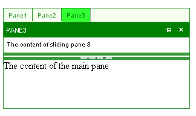

# Create a Custom Skin

The following tutorial demonstrates creating a custom **RadSplitter** skin, using the default skin as a base. This new skin will take the appearance of **RadSplitter** from its default look: 

to the following:

 

See [Understanding the Skin CSS File]() for more information on specific CSS file properties. 

## Prepare the Project

1. Start a new AJAX-enabled Web application. 

2. Drag a **RadSplitter** control from the toolbox onto your Web page. 

3. Add panes, split bar, sliding zone, and sliding panes to the splitter so that it can display various aspects of the skin. You can add controls by dragging them from the toolbox, or simply copy and paste the following declaration: 

	**ASP.NET**
	
		<telerik:RadSplitter RenderMode="Lightweight" runat="server" ID="RadSplitter1" Orientation="Horizontal" Width="90%"
			Height="90%">
			<telerik:RadPane runat="server" ID="RadPane1" Height="80px">
				<telerik:RadSlidingZone runat="server" ID="RadSlidingZone1">
					<telerik:RadSlidingPane runat="server" Title="Pane1" ID="RadSlidingPane1" Height="50px">
						The content of Sliding Pane 1
					</telerik:RadSlidingPane>
					<telerik:RadSlidingPane runat="server" Title="Pane2" ID="RadSlidingPane2" Height="50px">
						The content of sliding pane 2
					</telerik:RadSlidingPane>
					<telerik:RadSlidingPane runat="server" Title="Pane3" ID="RadSlidingPane3" Height="50px">
						The content of sliding pane 3
					</telerik:RadSlidingPane>
				</telerik:RadSlidingZone>
			</telerik:RadPane>
			<telerik:RadSplitBar runat="server" ID="RadSplitBar1" CollapseMode="Both" />
			<telerik:RadPane runat="server" ID="RadPane2" Height="80px">
				The content of the main pane
			</telerik:RadPane>
		</telerik:RadSplitter>

4. In the Solution Explorer, create a new "Green" directory in your project. 

5. Copy the default **RadSplitter** skin files from the installation directory to the "Green" directory; copy both the \Splitter directory that contains the images for this skin and the Splitter.Default.css file that defines the skin styles. 

	>note The file path will typically be similar to this example: _\Program Files\Telerik\&lt;Your Version of Telerik UI for ASPNET AJAX&gt;\Skins\Default._

6. In the Solution Explorer, rename "Splitter.Default.css" to "Splitter.Green.css". The Solution Explorer should now look something like the following:

	
	
7. Open Splitter.Green.css and replace all instances of _Default with _Green. Then save the file: 

	

8. Drag the "Splitter.Green.Css" file from the Solution Explorer onto your Web page. This automatically adds a reference to the page "&lt;head&gt;" tag as a "&lt;link&gt;" to the new stylesheet:

	

9. Select the **RadSplitter** control on your Web page. 
	* Set the **EnableEmbeddedSkins** property to **False**.
	* Change the **Skin** property to "Green". 
	
10. Run the application. Expand one of the tabs in the sliding zone. The new "Green" skin should look just like the default skin:

	

 

## Css classes for RadSplitter, RadPane, and RadSplitBar

1. At the top of the CSS file is a selector for many CSS classes, all qualified by the **.RadSplitter_Green** CSS class. The **.RadSplitter_Green** CSS class is applied to the top-level &lt;table&gt; element that is used to render the splitter control. All the other CSS classes defined in the CSS file are qualified by this class, so that they apply only to parts of the splitter control (elements inside this &lt;table&gt;). The first rule defines the borders for most of the elements inside the splitter, including the panes **(.pane** and **.paneHorizontal**), split bars (**.resizeBar** and **.resizeBarHorizontal**, plus **.resizeBarOver**, **.resizebarOverHorizontal**, **.resizeBarInactive**, and **.resizebarInactiveHorizontal** for the split bars in special states), and the resizable border of sliding panes (**.slideContainerResize** and **.slideContainerResizeHorizontal**, plus **.slideContainerResizeOver** and **.slideContainerResizeOverHorizontal** for when the mouse hovers over the border). 

2. Change the border color defined by the first rule in the CSS file from "#383838" to "#389938": 

	**CSS**
	
		.RadSplitter_Green .resizeBar, .RadSplitter_Green .slideContainerResize, 
		.RadSplitter_Green .slideContainerResizeHorizontal, .RadSplitter_Green .resizeBarOver, 
		.RadSplitter_Green .slideContainerResizeOver, .RadSplitter_Green .slideContainerResizeOverHorizontal, 
		.RadSplitter_Green .resizeBarInactive, .RadSplitter_Green .resizeBarHorizontal, 
		.RadSplitter_Green .resizeBarOverHorizontal, .RadSplitter_Green .resizeBarInactiveHorizontal, 
		.RadSplitter_Green .pane, .RadSplitter_Green .paneHorizontal
		{
			border: 1px solid #389938;
		}

3. Locate the rule for the split bars and resizable borders on sliding panes. This has the same selectors as the rule for the borders that you just changed, except that there are no selectors for the panes of the splitter. Change the background color from "#383838" to "#389938", so that the resize bars have the same color as the borders: 

	**CSS**
	
		.RadSplitter_Green .resizeBar, .RadSplitter_Green .slideContainerResize, 
		.RadSplitter_Green .slideContainerResizeHorizontal, 
		.RadSplitter_Green .resizeBarOver, .RadSplitter_Green .slideContainerResizeOver, 
		.RadSplitter_Green .slideContainerResizeOverHorizontal, 
		.RadSplitter_Green .resizeBarInactive, .RadSplitter_Green .resizeBarHorizontal, 
		.RadSplitter_Green .resizeBarOverHorizontal, 
		.RadSplitter_Green .resizeBarInactiveHorizontal
		{
			padding: 0;
			background: #389938;
			font-size: 1px;
			text-align: center;
		}

4. Locate the rule that applies only when the mouse is over the split bar or resizable border. This specifies the color when the mouse is over a resizable border or split bar. Change the background color from "#383838" to "#38ff38": 

	**CSS**
	
		.RadSplitter_Green .resizeBarOver, .RadSplitter_Green .resizeBarOverHorizontal, 
		.RadSplitter_Green .slideContainerResizeOver, 
		.RadSplitter_Green .slideContainerResizeOverHorizontal
		{
			background: #38ff38;
		}

5. While the user is dragging a split bar or resizable border, the position of the dragged split bar or border is rendered with a semi-opaque image. For split bars, this image has the **.helperBarDrag** or **.helperBarDragHorizontal** class applied. For resizable borders, this image has the .helperBarSlideDrag or .helperBarSlideDragHorizontal class applied. Locate the selector for these classes, and change the background color from "#ccc" to "#cfa": 

	**CSS**
	
		.RadSplitter_Green .helperBarDrag, .RadSplitter_Green .helperBarDragHorizontal, 
		.RadSplitter_Green .helperBarSlideDrag, .RadSplitter_Green .helperBarSlideDragHorizontal
		{
			font-size: 1px;
			background-color: #cfa;
			filter: progid:DXImageTransform.Microsoft.Alpha(opacity=60);
			opacity: 0.6;
		}

6. When the user tries to drag a split bar or resizable border too far, so that the resulting change would cause an invalid layout (for example, causing a pane to exceed its maximum size), the image of the split bar or border changes its appearance to provide feedback to the user that it is not moving because of a problem. When this occurs, the drag image has the **.helperBarError**, **.helperBarSlideError**, or **.helperBarErrorHorizontal** class applied (depending on whether it is a vertical split bar, resizable border, or horizontal split bar being dragged). Locate these selectors, and change the color of the drag image from "#f60" to "red" when an error condition arises: 

	**CSS**
	
		.RadSplitter_Green .helperBarError, .RadSplitter_Green .helperBarSlideError, 
		.RadSplitter_Green .helperBarErrorHorizontal
		{
			font-size: 1px;
			background-color: red;
			filter: progid:DXImageTransform.Microsoft.Alpha(opacity=60);
			opacity: 0.6;
		}

7. Locate the rules with the selectors **.RadSplitter_Green .resizeBarHorizontal** and **.RadSplitter_Green .resizeBar** that assign a background image to the split bar (either "Splitter/splitbarBg.gif" or "Splitter/splitbarBgVertial.gif"). Delete these rules, so that the background color you assigned previously can show. 

8. Run the application. The **RadSplitter** panes and split bars now display their new appearance. Drag a split bar and note the new drag image:

	

 

## Css classes for RadSlidingZone

1. The **RadSlidingZone** control is rendered using a &lt;table&gt; element with the **.slideZone** class applied. Locate the selector for this class, and change the background color from "white" to "#f5ffef": 

	**CSS**
	
		.RadSplitter_Green .slideZone
		{
			background: #f5ffef;
		}
		
2. The portion of the sliding zone that holds the sliding zone tabs has the **.tabsContainer** class applied. If the **SlideDirection** is "Bottom", the **.bottom** class is applied as well. Locate the selectors for these classes that are used to add a border to the sliding zone, and change the border color from "#383838" to "#389938": 

	**CSS**

		.RadSplitter_Green .tabsContainer
		{
			border-right: 1px solid #389938;
		}
		.RadSplitter_Green .tabsContainer.bottom
		{
			border-bottom: 1px solid #389938;
			border-right: 0;
		}	

3. Locate the selector **.RadSplitter_Green .tabsContainer div**. This rule affects all the &lt;div&gt; elements inside the sliding zone, which are the rendered images of portions of the title bar. Change the color attribute from "#383838" to "#389938" to change the font color of the title: 

	**CSS**
	
		.RadSplitter_Green .tabsContainer div
		{
			overflow: hidden;
			cursor: default;
			text-align: center;
			font-size: 1px;
			color: #389938;
			padding: 6px 0;
			width: 21px;
			height: auto;
			border-bottom: 1px solid #313131;
		}

4. When a tab in the sliding zone is expanded to show its sliding pane, it has the **.paneTabContainerExpanded** or **.paneTabContainerExpandedHorizontal** class applied. Locate the selectors **.RadSplitter_Green .tabsContainer.paneTabContainerExpanded**, **.RadSplitter_Green .tabsContainer .paneTabContainerExpandedHorizontal**, and change the background and foreground colors from "#323232" and "#fff" to "#32ff32" and "green": 

	**CSS**
	
		.RadSplitter_Green .tabsContainer .paneTabContainerExpanded, 
		.RadSplitter_Green .tabsContainer .paneTabContainerExpandedHorizontal
		{
			background: #32ff32;
			color: green;
		}

5. When a sliding pane is docked, its tab in the sliding zone has the **.paneTabContainerDocked** or **.paneTabContainerDockedHorizontal** class applied. Locate the selectors **.RadSplitter_Green .paneTabContainerDocked** and **.RadSplitterGreen .paneTabContainerDockedHorizontal**, and change the background from "#e4e4e4" to "#32dd32": 

	**CSS**
	
		.RadSplitter_Green .paneTabContainerDocked, 
		.RadSplitter_Green .paneTabContainerDockedHorizontal
		{
			background: #32dd32;
		}

6. Each tab in the sliding zone has either the **.paneTabContainer**, **.paneTabContainerExpanded**, or **.paneTabContainerDocked** class applied. Its immediate container has the **.top**, **.bottom**, **.left**, or **.right** class applied, depending on the **SlideDirection** property. The CSS file contains a number of selectors that combine these classes to provide the borders of individual tabs. Locate these selectors and change the border color from "#c3c3c3" to "#389938". The new rule is shown for the selectors that include the **.bottom** class: 

	**CSS**
	
		.RadSplitter_Green .bottom .paneTabContainer, 
		.RadSplitter_Green .bottom .paneTabContainerExpanded, 
		.RadSplitter_Green .bottom .paneTabContainerDocked
		{
			border-right: solid 1px #389938;
			border-left: 0;
			float: left;
			padding: 0 6px;
			width: auto;
		}

1. Run the application to see the effect of your changes: 

	

 

## Css classes for RadSlidingPane

1. The **RadSlidingPane** control is rendered using a &lt;table&gt; element with the **.slideContainer** class applied. Its header is a row in the table with the **.slideHeader** or **.slideHeaderDocked** class applied. Locate the selectors for these classes. Replace the background image (slideHeader.gif) with a solid green background: 

	**CSS**
			
		.RadSplitter_Green .slideHeader, .RadSplitter_Green .slideHeaderDocked
		{
			background: green;
			color: #fff;
			text-transform: uppercase;
		}

2. Locate the paired selectors for **.RadSplitter_Green .slideContainerResize** and **.RadSplitter_Green .slideContainerResizeHorizontal**, and the paired selectors for **.RadSplitter_Green .slideContainerResizeOver** and **.RadSplitter_Green .slideContainerResizeOverHorizontal**. These two rules set a background color for the resizable border of the sliding pane. Change the color to match the settings you applied previously to the split bars: 

	**CSS**

		.RadSplitter_Green .slideContainerResize, 
		.RadSplitter_Green .slideContainerResizeHorizontal
		{
			background: #389938 none;
		}
		.RadSplitter_Green .slideContainerResizeOver, 
		.RadSplitter_Green .slideContainerResizeOverHorizontal
		{
			background: #38ff38 none;
		}

3. Locate the selector **.RadSplitter_Green .slideTitleContainer**. This class is applied to the title bar of the sliding pane. Change the background-color from "#f7f7f7" to "Green" and remove the background attribute that loads a background image: 

	**CSS**
	
		.RadSplitter_Green .slideTitleContainer
		{
			background-color: Green;
		}

4. Run the application to see the effect of your changes: 

	
 

For more information about Cascading Style Sheets, see

* [World Wide Web Consortium CSS specifications](http://www.w3.org/Style/CSS/)
* [W3 Schools CSS tutorial](http://www.w3schools.com/css/default.asp)
* [Guide to Cascading Style Sheets](http://www.htmlhelp.com/reference/css/)
* [Telerik ThemeBuilder for ASP.NET AJAX](http://themebuilder.telerik.com/)

 

