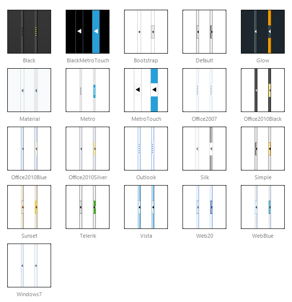

# Skins

**RadSplitter** uses **skins** to control its overall look-and-feel. A skin is a set of images and a CSS stylesheet that can be applied to the control elements (items, images, etc.) and defines their look and feel. The **RadSplitter** skin affects the appearance of any **RadPane**, **RadSplitBar**, **RadSlidingZone**, and **RadSlidingPane** controls nested inside the splitter. You can however, assign a different skin to any nested splitters.

To apply a skin to a **RadSplitter** control, set its **Skin** property, either using the properties pane or the [Smart Tag]().

**RadSplitter** is installed with a number of preset skins. These are shown below:

 

 @[template - Material skin is available only in Lightweight mode](/_templates/common/skins-notes.md#material-only-in-lightweight) 

## Customizing Skins

You can tweak the existing skins or create your own. Each skin has two main elements: images and a stylesheet. When creating your own, it is a good idea to start with the stylesheet for an existing skin and alter that. See [Creating a Custom Skin]() for a step-by-step walk through. To use your own skin

1. Add the new CSS file to your project.

1. Drag and drop the CSS file from the Project Explorer onto your Web page.

1. Set the **EnableEmbeddedSkins** property of the control to **False**.

The stylesheet for a **RadSplitter** skin has the name **Splitter.[SkinName].css** and can be found in the **...Skins/[SkinName]** directory. The images are found in the **...Skins/[SkinName]/Splitter** directory. For example, the stylesheet for the "Black" skin is called Splitter.Black.css and is located in the ...Skins/Black directory. The images are found in the ...Skins/Black/Splitter directory. The images are referenced by name from within the stylesheet.

For more information on the CSS File structure, see [Understanding the Skin CSS File]().
