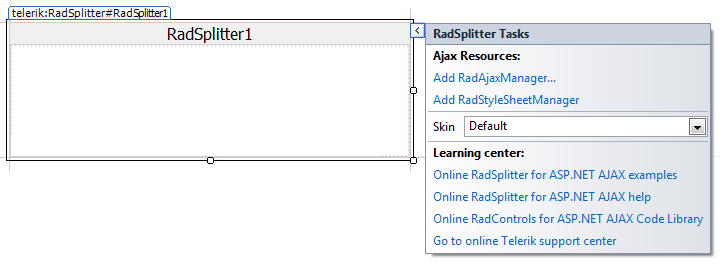

# Design Time

The Smart Tag allows easy access to frequently needed tasks. You can display the __Smart Tag__ by right clicking on a control in the design window, and choosing __Show Smart Tag__ from its context menu.
>caption 

## RadSplitter Smart Tag

The __RadSplitter__ Smart Tag lets you perform the following:

## Ajax Resources

* __Add RadAjaxManager...__ adds a RadAjaxManager component to your Web page, and displays the __r.a.d.ajax Property Builder__ where you can configure it.

* __Add RadStyleSheetManager__ adds a __RadStyleSheetManager__ to your Web page.

## Skin

The __Skin__ drop-down lets you select from a list of available [skins]() to customize the look of your __RadSplitter__ control.

## Learning Center

Links navigate you directly to __RadSplitter__ examples, help, or code library.

## RadPane, RadSlidingZone, and RadSlidingPane Smart Tags

The Smart Tag for the __RadPane__, __RadSlidingZone__, or __RadSlidingPane__ control contains only the AJAX resources links. These controls inherit their skin from the parent __RadSplitter__ control. For links to examples, help, or code library, use the __Learning center__ of the parent __RadSplitter__ control.

>caption 

>caption 

>caption 

