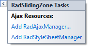

# Design Time

The Smart Tag allows easy access to frequently needed tasks. You can display the **Smart Tag** by right clicking on a control in the design window, and choosing **Show Smart Tag** from its context menu.

## RadSplitter Smart Tag

The **RadSplitter** Smart Tag lets you perform the following:

## Ajax Resources

* **Add RadAjaxManager...** adds a RadAjaxManager component to your Web page, and displays the **r.a.d.ajax Property Builder** where you can configure it.

* **Add RadStyleSheetManager** adds a **RadStyleSheetManager** to your Web page.

## Skin

The **Skin** drop-down lets you select from a list of available [skins]() to customize the look of your **RadSplitter** control.

## Learning Center

Links navigate you directly to **RadSplitter** examples, help, or code library.

## RadPane, RadSlidingZone, and RadSlidingPane Smart Tags

The Smart Tag for the **RadPane**, **RadSlidingZone**, or **RadSlidingPane** control contains only the AJAX resources links. These controls inherit their skin from the parent **RadSplitter** control. For links to examples, help, or code library, use the **Learning center** of the parent **RadSplitter** control.

