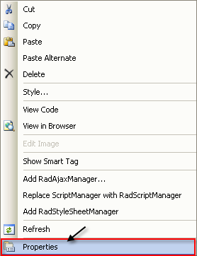
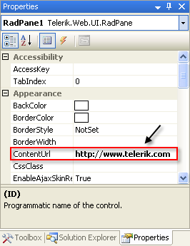
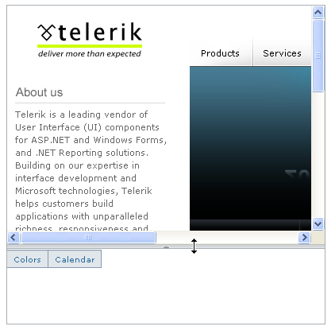

# Getting Started Overview

This tutorial will walk you through creating a Web page that contains a __RadSplitter__ control. It shows how to:

* Add panes and split bars to the splitter, creating resizable regions.

* Set the orientation of the splitter.

* Load external content into a pane.

* Configure which panes can be collapsed.

* Specify the minimum dimensions of a pane.

* Add a sliding zone to a pane.

* Add sliding panels to a sliding zone.

* Use skins to provide a consistent look & feel.

## RadSplitter

1. Drag a __RadSplitter__ control from the toolbox onto your Web page. It's [Smart Tag]() should appear automatically:
>caption 

1. In the __Skin__ drop-down list, select the "WebBlue" skin:
>caption 

1. Right-click the __RadSplitter__ control to display its context menu, and choose Properties:
>caption 

1. In properties pane for the splitter, locate the __LiveResize__ property, and set it to __True__. This causes the panes of the splitter to display their content even during resize operations. Locate the __Orientation__ property and set it to "Horizontal". This causes the panes of the splitter to stack on top of each other:
>caption 

1. Drag a __RadPane__ control from the toolbox onto the surface of the splitter:
>caption 

1. In the properties pane, set the __ContentUrl__ property to "http://www.telerik.com". This tells the pane to load its content from an external source (the Telerik Web site) :
>caption 

1. Drag a __RadSplitBar__ from the toolbox onto the __RadSplitter__ control, below the __RadPane__. Using the properties pane, set its __CollapseMode__ property to "Forward". This gives the split bar the ability to collapse the first __RadPane__, but not the one that follows it.
>caption 

1. Drag a second __RadPane__ from the toolbox onto the __RadSplitter__ control, below the __RadSplitBar__.

1. Set its __Height__ property to "25px", its __MinHeight__ property to 25 and its __Scrolling__ property to "None". The __Height__ property sets its initial height to 25 pixels. The __MinHeight__ property ensures that this pane cannot be resized any smaller. The __Scrolling__ property prevents the pane from displaying scroll bars.
>caption 

1. Drag a __RadSlidingZone__ control from the toolbox onto the surface of __RadPane2__. Set its __SlideDirection__ property to "Top". This specifies that sliding panes inside the sliding zone expand upward.

1. Drag a __RadSlidingPane__ from the toolbox onto the surface of the sliding zone. Set the following properties:

* Set __TabView__ to "TextOnly". This specifies that the tab for the sliding panel displays the title but no image.

* Set __Title__ to "Colors". This is the title that appears on the tab for the sliding panel.

* Set __Height__ to 105.

* Set __EnableResize__ to __False__. This prevents the sliding panel from being resized when it is expanded.

1. Drag a __RadColorPicker__ control from the toolbox onto the surface of the sliding panel, to give it some content to display.

1. Drag another __RadSlidingPane__ from the toolbox onto the surface of the sliding zone. Set the following properties:

* Set __TabView__ to "TextOnly".

* Set __Title__ to "Calendar".

* Set __Height__ to "180".

1. Drag a __RadCalendar__ control from the toolbox onto the surface of the __RadSlidingPane__ you just added. Set its __Skin__ property to "WebBlue", so that it matches the splitter controls.

1. Run the application. The __RadSplitter__ control appears, showing the two panes you added. The top pane shows content from an external source. The lower pane shows the __RadSlidingZone__, with tabs for the two __RadSlidingPane__ controls:
>caption 

1. Note that the split bar has a little arrow in the center, click on this arrow to collapse the first pane. The arrow changes direction.
>caption 

1. Click on the arrow to restore the first pane.

1. Drag on the split bar. Note that it doesn't let you make the second pane any smaller, but you can resize in an upward direction, and then down again.
>caption 

1. Hover the mouse over the tabs in the __RadSlidingZone__, and see the sliding panels appear and disappear:
>caption 

1. Note the controls on the upper right corner of the sliding panel. You can use these to pin the panel in place or make it collapse. The "Calendar" panel has a bar at the top that you can drag on to resize the panel, while the "Colors" panel has no such capability:
>caption 

