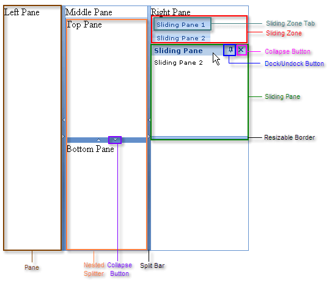

# Structure

The **RadSplitter** control defines a region that can be divided into resizable frame-like regions called panes, as shown below:



## Panes

Each pane is implemented by the **RadPane** control. Panes can contain any kind of content, including HTML elements, [content from external sources](), or other ASP.NET controls: even [other RadSplitter controls](), to subdivide the region the pane defines into additional resizable regions.

Depending on the [orientation]() of the splitter, panes are laid out from left to right or top to bottom.

## Split Bars

Between the panes appear split bars, which are implemented by the **RadSplitBar** control. Split bars represent the borders that can be dragged in order to [resize the panes](). Each split bar can have up to two **collapse buttons**, used to [collapse and expand]() the adjacent panes.

## Sliding Zones

Sliding zones, which are implemented by the **RadSlidingZone** control, hold panes (called sliding panes) that slide in and out, like the user interface of Visual Studio. **RadSlidingZone** must be placed inside a **RadPane** control.

Sliding zones represent the sliding panes they hold as [sliding zone tabs](). The user uses these tabs to collapse and expand the sliding panes. You can configure the [direction]() in which the sliding zone expands its tabs. This direction determines the way the sliding zone lays out its sliding zone tabs.

## Sliding Panes

Sliding panes are placed inside sliding zones to define their content. Each sliding pane is implemented by a **RadSlidingPane** control. **RadSlidingPane** must be placed inside a **RadSlidingZone** control.

A sliding pane, like a regular pane, can contain any HTML elements, including ASP.NET controls (but not externally loaded content). Sliding panes, unlike regular panes, have a title bar that displays the title of the pane (which also appears on its tab). The title bar optionally contains [control buttons]() as well: a dock/undock button, which pins the sliding pane in place, and a collapse button that collapses the sliding pane. The edge of the sliding pane farthest from the sliding zone tab optionally has a **resizable border**, that the user can drag to expand or contract the size of the sliding pane.

## Example

The ASP.NET declaration for the **RadSplitter** shown above is as follows:

````ASP.NET	     
<telerik:RadSplitter ID="RadSplitter1" runat="server" Skin="Office2007">
 <telerik:RadPane ID="LeftPane" runat="server">
	Left Pane
 </telerik:RadPane>
 <telerik:RadSplitBar ID="RadSplitBar1" runat="server" CollapseMode="Both" />
 <telerik:RadPane ID="MiddlePane" runat="server" Scrolling="None">
   Middle Pane
   <telerik:RadSplitter ID="NestedSplitter" runat="server"
						Orientation="Horizontal" Skin="Office2007" >
	 <telerik:RadPane ID="TopPane" runat="server">
	   Top Pane
	 </telerik:RadPane>
	 <telerik:RadSplitBar ID="RadSplitBar3" runat="server" CollapseMode="Both" />
	 <telerik:RadPane ID="BottomPane" runat="server">
	   Bottom Pane
	 </telerik:RadPane>
   </telerik:RadSplitter>
 </telerik:RadPane>
 <telerik:RadSplitBar ID="RadSplitBar2" runat="server" CollapseMode="Both" />
 <telerik:RadPane ID="RightPane" runat="server">
   Right Pane                           
   <telerik:RadSlidingZone ID="RadSlidingZone1" runat="server" SlideDirection="Bottom">
	 <telerik:RadSlidingPane ID="RadSlidingPane1" runat="server" Title="Sliding Pane 1">
	   Sliding Pane1
	 </telerik:RadSlidingPane>
	 <telerik:RadSlidingPane ID="RadSlidingPane2" runat="server" Title="Sliding Pane 2">
	   Sliding Pane 2
	 </telerik:RadSlidingPane>
   </telerik:RadSlidingZone>
 </telerik:RadPane>
</telerik:RadSplitter> 				
````


## See Also

 * [Creating Splitter Programmatically]()

 * [Creating SlidingZone Programmatically]()
