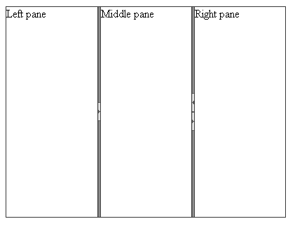

# Declaring Splitter

With **RadSplitter** you can define any table layout.

* **Simple splitter** - using one splitter you can define a horizontally or vertically split page or area in a page.

* **Complex splitter** - you can define complex layouts using several nested splitters that provide both horizontally and vertically split regions.

>note RadSplitter must have at least two child RadPanes. You can experience many unexpected issues when the control is used with a single RadPane, making it a highly not recommended scenario.

## Simple Structures with a Single Splitter

The easiest way to define the **RadSplitter** structure is declaratively in the ASPX page. The following example demonstrates how to declare a **Vertical** splitter with three collapsible panes and split bars with different collapse modes:

````ASP.NET	 
<telerik:RadSplitter RenderMode="Lightweight" runat="server" id="RadSplitter1"
 Orientation="Vertical" width="400px" height="300px">
 <telerik:RadPane runat="server" id="LeftPane">
   <asp:Label runat="server" id="LeftLabel">Left pane</asp:Label>
 </telerik:RadPane>
 <telerik:RadSplitBar runat="server" id="RadSplitBar1" CollapseMode="Backward" />
 <telerik:RadPane runat="server" id="MidPane">Middle pane</telerik:RadPane>
 <telerik:RadSplitBar runat="server" id="RadSplitBar2" CollapseMode="Both" />
 <telerik:RadPane runat="server" id="RightPane">Right pane</telerik:RadPane>
</telerik:RadSplitter> 			
````


The result looks as follows:



## See Also

 * [Nesting Splitters]()

 * [Fixed Layout]()

 * [Creating Splitter Programmatically]()

 * [Structure]()
