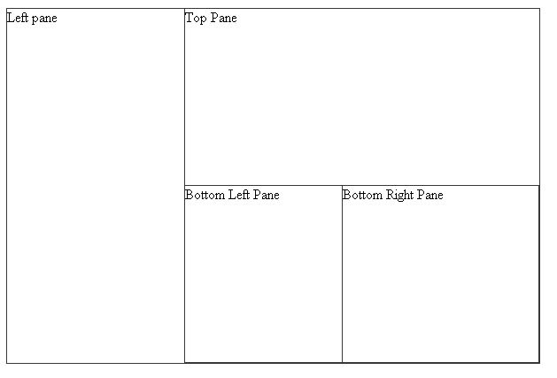

# Fixed Layout


## 

You can use RadSplitter to create several non-resizable regions. To do this, simply add __RadPane__ controls to the splitter without any __RadSplitBar__ controls between them:
>caption 



>tip The borders of the panes can be removed by setting the __PanesBorderSize__ property to 0.
>


The layout above was produced by the following declaration:

````ASPNET
	     
	<telerik:RadSplitter runat="server" id="RadSplitter1"
	   Orientation="Vertical" width="600px" height="400px">
	 <telerik:RadPane runat="server" id="LeftPane" Width="200px">
	   Left pane
	 </telerik:RadPane>
	 <telerik:RadPane runat="server" id="RightPane" Width="400px">
	   <telerik:RadSplitter runat="server" id="RadSplitter2"
	       Orientation="Horizontal">
	     <telerik:RadPane runat="server" id="TopPane">
	       Top Pane
	     </telerik:RadPane>
	     <telerik:RadPane runat="server" id="BottomPane">
	       <telerik:RadSplitter runat="server"
	           Orientation="Vertical" Width="400px">
	         <telerik:RadPane runat="server" Width="40%">
	           Bottom Left Pane
	         </telerik:RadPane>
	         <telerik:RadPane runat="server">
	           Bottom Right Pane
	         </telerik:RadPane>
	       </telerik:RadSplitter>
	     </telerik:RadPane>
	   </telerik:RadSplitter>
	 </telerik:RadPane>
	</telerik:RadSplitter> 
				
````


>tip If you want to make changes to some of the panes at runtime, such as resizing or collapsing them, you can use the[client-side API]().
>

