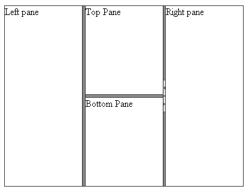

# Nesting Splitters

By nesting splitters inside the panes of other splitters and alternating the [Orientation]() of the nested splitters, you can define complex structures that divide the page into vertically and horizontally resizable regions. You can nest splitters up to any depth.

By default, the nested splitters are resized when the panes that contain them are resized. If you do not want the nested splitters to resize together with their parent panes, set the **ResizeWithParentPane** property to **False**.

>tip RadSplitter must have at least two child RadPanes. You can experience many unexpected issues when the control is used with a single RadPane, making it a highly not recommended scenario.

The following layout nests a splitter with a horizontal split bars inside a splitter with vertical split bars:

````ASP.NET	 
<telerik:RadSplitter RenderMode="Lightweight" runat="server" id="RadSplitter1"
   Orientation="Vertical" width="400px" height="300px">
 <telerik:RadPane runat="server" id="LeftPane">Left pane</telerik:RadPane>
 <telerik:RadSplitBar runat="server" id="RadSplitBar1" />
 <telerik:RadPane runat="server" id="MiddlePane">
   <telerik:RadSplitter RenderMode="Lightweight" runat="server" id="InnerSplitter" Orientation="Horizontal">
	 <telerik:RadPane runat="server" id="TopPane">Top Pane</telerik:RadPane>
	 <telerik:RadSplitBar runat="server" id="RadSplitBar2" />
	 <telerik:RadPane runat="server" id="BottomPane">Bottom Pane</telerik:RadPane>
   </telerik:RadSplitter>
 </telerik:RadPane>
 <telerik:RadSplitBar runat="server" id="RadSplitBar3" CollapseMode="Both" />
 <telerik:RadPane runat="server" id="RightPane">Right pane</telerik:RadPane>
</telerik:RadSplitter> 			
````


The declaration above results in the following layout:



## See Also

 * [Fixed Layout]()
