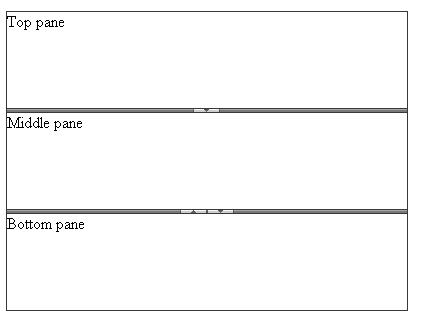
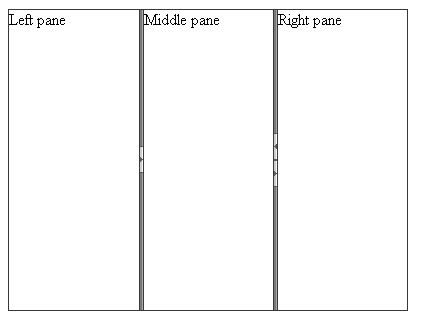

# Orientation


The __Orientation__ property of the __RadSplitter__ control defines the __orientation of its split bars__:

* The __Horizontal__ orientation renders horizontal split bars, which can be moved up and down to [resize the height of the splitter's panes](). The panes themselves are stacked vertically:
>caption 



* The __Vertical__ orientation renders vertical split bars, which can be moved left and right to resize the width of the splitter's panes. The panes themselves are laid out side by side:
>caption 



>tip To create a splitter that contains both horizontal and vertical split bars you can nest several splitters with different orientations.
>


## Setting Orientation

You can assign the orientation declaratively in the __RadSplitter__ declaration:

````ASPNET
	     
	<telerik:RadSplitter
	   runat="server"
	   id="RadSplitter1"
	   Orientation="Horizontal">
	 <telerik:RadPane runat="server" id="TopPane">
	   Top pane
	 </telerik:RadPane>
	 <telerik:RadSplitBar runat="server" id="RadSplitBar1" />
	 <telerik:RadPane runat="server" id="MiddlePane">
	   Middle pane
	 </telerik:RadPane>
	 <telerik:RadSplitBar runat="server" id="RadSplitBar2" />
	 <telerik:RadPane runat="server" id="BottomPane">
	   Bottom pane
	 </telerik:RadPane>
	</telerik:RadSplitter> 
				
````


You can also set the __Orientation__ property of the splitter from the code-behind:

>tabbedCode

````C#
	
	    protected void Page_Load(object sender, EventArgs e)
	    {
	        if (!IsPostBack)
	        {
	            RadSplitter1.Orientation = Telerik.Web.UI.Orientation.Horizontal;
	        }
	    } 
				
````


````VB
	     
	    Protected Sub Page_Load(ByVal sender As Object, _
	          ByVal e As System.EventArgs) Handles Me.Load
	        If Not IsPostBack Then
	            RadSplitter1.Orientation = Telerik.Web.UI.Orientation.Horizontal
	        End If
	    End Sub
	
````


>end

# See Also

 * [Nesting Splitters]()
