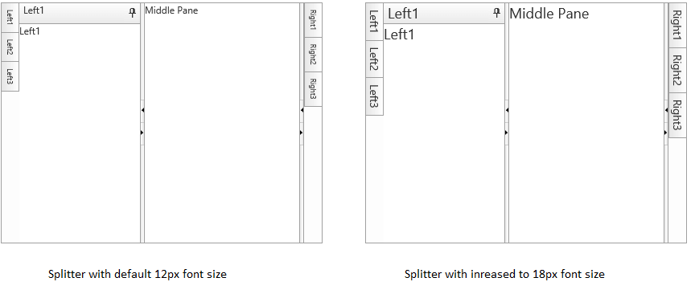

# Elastic Design


This article explains the **elastic design capabilities RadSplitter offers**. The [Lightweight RenderMode]() of RadSplitter supports **elastic design as of Q3 2015** (**Figure 1**).

@[template](/_templates/common/render-mode.md#resp-design-desc "slug-el: no, slug-fl: no")


>caption Figure 1: Comparison between the appearance of a RadSplitter with regular font size and with increased font size. See the code in **Example 2**.




**RadSplitter** does not create elastic design by itself, but can fit in a page that follows this pattern. This means that its **Lightweight RenderMode** supports **changing the font size** without breaking the control's appearance - if the new size is larger than the original, the elements in the control will simply increase their size as well to accommodate the text. This fluid layout is achieved by using `em` units for setting dimensions and paddings in the control, instead of `px`because `em` units are tied to the font size. This allows dimensions and sizes to scale with the font size.


>note **RadSplitter** takes the font-size of the page automatically. If the developer does not set it explicitly (**Example 1**), this is up to the client's browser and a common default value is 16px.


>caption **Example 1**: Setting default font for the page with the default value for the Telerik controls.

```CSS
body {
	font-size: 12px; /* 12px is the default value for Telerik controls */
	font-family: "Segoe UI", Arial, Sans-serif;
}
````

>important Only the SlidingPanes titles and the content in the Panes inherit the font size. Splitbars, sliding panes' headers and icons do not change in size because most of the control rendering is implemented via `<table>` elements.


>caption **Example 2**: Changing the font-size of a RadSplitter. 

````CSS
body
{
	font-size: 18px;
	font-family: "Segoe UI", Arial, Sans-serif;
}
````

````ASP.NET
<telerik:RadSplitter RenderMode="Lightweight" ID="Radsplitter1" runat="server" height="300" width="400">
	<telerik:RadPane ID="LeftPane" runat="server" width="22">
		<telerik:RadSlidingZone ID="LeftSlidingZone" runat="server" Width="22" DockedPaneId="LeftSlidingPane1">
			<telerik:RadSlidingPane ID="LeftSlidingPane1" Title="Left1" runat="server" Width="150">
				Left1
			</telerik:RadSlidingPane>
			<telerik:RadSlidingPane ID="LeftSlidingPane2" Title="Left2" runat="server" Width="250">
				Left2
			</telerik:RadSlidingPane>
			<telerik:RadSlidingPane ID="LeftSlidingPane3" Title="Left3" runat="server" Width="150">
				Left3
			</telerik:RadSlidingPane>
		</telerik:RadSlidingZone>
	</telerik:RadPane>
	<telerik:RadSplitBar ID="RadSplitBar1" runat="server" CollapseMode="Both"  />
	<telerik:RadPane ID="MiddlePane" runat="server">Middle Pane</telerik:RadPane>
	<telerik:RadSplitBar ID="RadSplitBar2" runat="server" CollapseMode="Both" />
	<telerik:RadPane ID="RightPane" runat="server" width="22">
		<telerik:RadSlidingZone ID="RightSlidingZone" runat="server" width="22" SlideDirection="left">
			<telerik:RadSlidingPane ID="RightSlidingPane1" Title="Right1" runat="server" Width="150">
				Right1
			</telerik:RadSlidingPane>
			<telerik:RadSlidingPane ID="RightSlidingPane2" Title="Right2" runat="server" Width="250">
				Right2
			</telerik:RadSlidingPane>
			<telerik:RadSlidingPane ID="RightSlidingPane3" Title="Right3" runat="server" Width="150">
				Right3
			</telerik:RadSlidingPane>
		</telerik:RadSlidingZone>
	</telerik:RadPane>
</telerik:RadSplitter>
````


# See Also


 * [Render Modes]()


