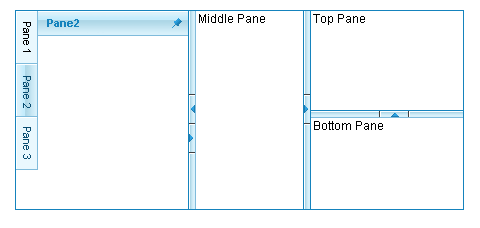

# Splitter Overview

## 

Telerik __RadSplitter for ASP.NET AJAX__ is a flexible UI component for managing the size and the layout of Web page content. __RadSplitter__ divides the layout of a Web page into frame-like regions called panes. Layouts can be conveniently enhanced further with sliding panes: dockable panels with resizable areas just as in Visual Studio, but boosted with ASP.NET AJAX capabilities.__RadSplitter__ offers the following features:

* [Content Resizing.]() Drag a split bar to resize the content area of the panes. You can define the maximum and minimum size of panes, and configure the way panes are resized when the user drags on a split bar, including specifying which panes are resized, setting the resize step size, allowing "live" resizes, and more.

* [Horizontal or Vertical Orientation](). Panes can be resized in either a horizontal or vertical direction.

* [Unlimited nesting](). You can combine splitters with different orientations to create more complex layouts when needed. You can even configure whether the nested splitters are resized when the pane that contains them is resized.

* [Initial Size](). You can specify the size of the splitter or the panes it contains in absolute units or as a percentage of the available space. You can even use the splitter to [fill the entire Web page]().

* [Fixed Layouts](). You do not need to make the panes resizable. The splitter can leave some or all of the panes fixed in size.

* [Collapsible Panes](). Users can click the collapse buttons on a split bar to collapse the adjacent panes, and then use the expand button on the split bar to restore the pane to its previous size.

* [External Content](). Panes can display any HTML elements you add, or load their content from any URL.

* [Content Printing](). Use the client-side API to print the content of any pane, as long as it comes from the same domain as your Web page.

* [Sliding Panes](). Add sliding zones and panes to maximize the use of screen real estate. Sliding panes can be configured for

* [Expansion in any direction]().

* [Different appearance of tabs]() in the sliding zone.

* [Behavioral capabilities](), including the way they are opened and closed, whether the user can dock them in place, and whether the user can resize them.

* [State Persistence](). The state of a __RadSplitter__ control persists across postbacks. You can even save the scrolled position of individual panes.

* [Skins](). Use skins to set the look-and-feel of the __RadSplitter__ and its child controls to give your Web site a uniform appearance.

* [Configurable tooltips](). You can customize the strings that appear in tool tips that let users know the function of control buttons.

* [Client-side API](). __RadSplitter__ has a rich client-side API that lets you customize the behavior of the splitter without postbacks, and numerous [client events]() to give you every opportunity to respond to the changes that users make.

* __Cross-browser support__. __RadSplitter__ supports all major browsers, including Internet Explorer 5.5 and above, Netscape 7.0 and above, Mozilla 1.0 and above,Firefox 1.0 and above, Opera 8.0 and above, and Safari 2.0.4 and above.
>caption 

# See Also

 * [Structure]()

 * [Overview]()

 * [Creating Splitter Programatically]()
