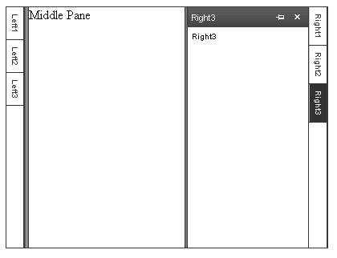

# Declaring Sliding Zones

**RadSlidingZone** and **RadSlidingPane** controls let you add sliding panes to your splitter control. Sliding panes are used to optimize the layout of a page. By defining sliding panes in the sliding zone container, you can initially hide content that your users do not need to see all the time.

By clicking on the pane tab, users can display the content of a sliding pane. Then the user can dock the content in the page layout if it should be visible all the time.

## Declarative Syntax

To declare a sliding zone, put a **RadSlidingZone** control into a regular **RadPane**. Then add as may **RadSlidingPane** controls as you want to the **RadSlidingZone**. Each time you add a **RadSlidingPane** control to the **RadSlidingZone**, the **RadSlidingZone** displays a tab for the pane, which can then be used to display the **RadSlidingPane** itself.

>note  **RadSlidingZone** controls must be placed inside a **RadPane** control. **RadSlidingPane** controls must be placed inside a **RadSlidingZone** control.

## Example

The following example illustrates how to declare left and right sliding zones, containing three sliding panes each:

````ASP.NET	     
<telerik:RadSplitter ID="Radsplitter1" runat="server" height="300" width="400">
<telerik:RadPane ID="LeftPane" runat="server" width="22">
 <telerik:RadSlidingZone ID="LeftSlidingZone" runat="server" width="22">
  <telerik:RadSlidingPane ID="LeftSlidingPane1" Title="Left1" runat="server" Width="150">
	Left1
  </telerik:RadSlidingPane>
  <telerik:RadSlidingPane ID="LeftSlidingPane2" Title="Left2" runat="server" Width="250">
	Left2</telerik:RadSlidingPane>
  <telerik:RadSlidingPane ID="LeftSlidingPane3" Title="Left3" runat="server" Width="150">
	Left3
  </telerik:RadSlidingPane>
 </telerik:RadSlidingZone>
</telerik:RadPane>
<telerik:RadSplitBar ID="RadSplitBar1" runat="server" />
<telerik:RadPane ID="MiddlePane" runat="server">Middle Pane</telerik:RadPane>
<telerik:RadSplitBar ID="RadSplitBar2" runat="server" />
<telerik:RadPane ID="RightPane" runat="server" width="22">
 <telerik:RadSlidingZone ID="RightSlidingZone" runat="server" width="22" SlideDirection="left" >
  <telerik:RadSlidingPane ID="RightSlidingPane1" Title="Right1" runat="server" Width="150">
	 Right1
  </telerik:RadSlidingPane>
  <telerik:RadSlidingPane ID="RightSlidingPane2" Title="Right2" runat="server" Width="250">
	Right2
  </telerik:RadSlidingPane>
  <telerik:RadSlidingPane ID="RightSlidingPane3" Title="Right3" runat="server" Width="150">
	Right3
  </telerik:RadSlidingPane>
 </telerik:RadSlidingZone>
</telerik:RadPane>
</telerik:RadSplitter> 				
````

The result looks as follows (with "RightSlidingPane3" expanded):



## See Also

 * [Creating SlidingZone Programmatically]()

 * [Structure]()
