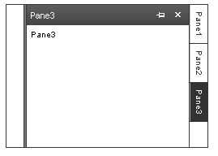
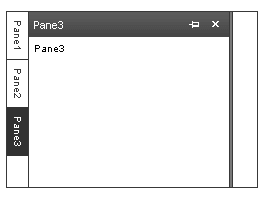
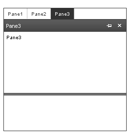
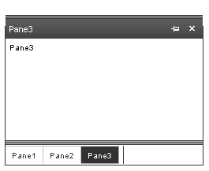

# Sliding Direction

You can position a **RadSlidingZone** at the left, right, top or bottom end of the splitter. In any of these cases, the **SlideDirection** property lets you configure the sliding zone so that the panes slide in the expected direction:

* Set the **SlideDirection** property to "Left" to configure the sliding zone so that panes slide from right to left. When **SlideDirection** is "Left", the sliding zone lays out its tabs vertically:

	

* Set the **SlideDirection** property to "Right" to configure the sliding zone so that panes slide from left to right. When **SlideDirection** is "Right", the sliding zone lays out its tabs vertically:

	

* Set the **SlideDirection** property to "Bottom" to configure the sliding zone so that panes slide from top to bottom. When **SlideDirection** is "Bottom", the sliding zone lays out its tabs horizontally:

	

* Set the **SlideDirection** property to "Top" to configure the sliding zone so that panes slide from bottom to top. When **SlideDirection** is "Top", the sliding zone lays out its tabs horizontally:

	

## See Also

 * [Specifying Tab appearance]()

 * [Sliding Pane Behavior]()
