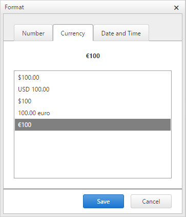

# Custom Cell Format 

The **RadSpreadsheet**'s cell-formatting options dialog can be customized. The existing options divided into three categories **Number**, **Currency** and **Date and Time** can be replaced by or complemented with additional formatting options. This can be achieved by adding a user control to the **RadSpreadsheet**'s CustomFormatTemplate:

````ASPNET
<telerik:RadSpreadsheet runat="server" ID="RadSpreadsheet1">
    <CustomFormatTemplate>
        <uc1:SpreadsheetCustomFormat runat="server" ID="SpreadsheetCustomFormat" />
    </CustomFormatTemplate>
</telerik:RadSpreadsheet>
```` 

>tip A sample code library project demostrating this approach can be downloaded [here](http://www.telerik.com/support/code-library/custom-format-template). 
>

The following screenshot shows the result of modifying the user control and including two additional formatting options ("100.00 euro" and "€100") in the Currency tab.

 

# Formatting options

## Strings

The format strings are compatible with the Excel number formats, with some exceptions:

* Exponent (scientific) notation (**E+**, **E-** Excel formats)

* Filling cell width (`*` Excel format)

A format string consists of one or more sections, separated by semicolons. A section optionally specifies a color and a condition.

>caption The following example demonstrates how to display a number with up to three decimals.

`#.###`

>caption The following example demonstrates how to display positive numbers, or zero, in green, and negative numbers in red.

`[Green]#.###;[Red]#.###`

>caption The following example demonstrates how to display positive numbers in green, negative numbers in red, and the the "Zero" text in blue if the number is zero.

`[Green]#.###;[Red]#.###;[Blue]"Zero"`

>caption This example is the same as the previous one, with the difference to display any possible text in the cell in magenta.

`[Green]#.###;[Red]#.###;[Blue]"Zero";[Magenta]@`

Excel documentation mentions that a maximum of four sections are supported, and if all are present, they are interpreted in the following order:

* Positive numbers format

* Negative numbers format

* Format for zero

* Format for text

Excel also supports a more flexible conditional formatting.

>caption The following example demonstrates how to display numbers greater than 100 in green, numbers less than minus 100 in yellow, and other numbers in cyan.

`[>100][GREEN]#,##0;[<=-100][YELLOW]#,##0;[CYAN]#,##0`

In this case it is not clear whether only up to four sections are allowed, of which the last one must be text, while the Spreadsheet formatter allows for any number of conditional sections.

## Text and Numbers

| Character | Meaning | 
| ------ | ------ |
| 0 |Digit placeholder. Use this to display insignificant zeroes. For example, 8.9 with the format 00.000 displays as 08.900.|
| `#` | Digit placeholder. This does not display insignificant zeroes. For example, 12.34 in the `###.###` format displays as 12.34. |
| ? | Digit placeholder. It is similar to 0, but displays a space character instead of a zero. You can use this to align numbers by decimal point, but you should use a fixed-width font for this to be effective. |
| . | Decimal point. |
| , | Thousands separator, or scale (see below). |
| \ | Escape the next character (display literally). |
| _ | Skip the width of the next character. |
| "text" | Includes a piece of text in the format. Characters inside will not be interpreted in any way, they will just output literally. |
| @ | Text placeholder. Will be replaced with the text in the cell. |

## Dates and Time

| Format String | Meaning | 
| ------ | ------ |
| m | Display month number without leading zero |
| mm | Display month number with leading zero |
| mmm | Display short month name in current culture |
| mmmm | Display full month name in current culture |
| d | Display date number without leading zero |
| dd | Display date number with leading zero |
| ddd | Display the abbreviated week day name |
| dddd | Display the full week day name |
| yy | Display the year as two digit number |
| YYYY | Display the full year number |
| h | Display hour without leading zero |
| hh | Display hour including leading zero |
| m | Display minute without leading zero |
| mm | Display minute including leading zero |
| s | Display second without leading zero |
| ss | Display second including leading zero |
| [h] | Elapsed time in hours |
| [m] | Elapsed time in minutes |
| [s] | Elapsed time in seconds |
| AM/PM | Forces hours to display in 12-hours clock, and displays AM or PM as necessary |
| am/pm | Same as above, but displays lower-case am or pm |
| A/P | Same as above, but displays A or P |
| a/p | Same, but displays a or p |

Note that the month and minute specifiers are ambiguous (m or mm). These strings are interpreted as a month number, unless preceded by an hour part (h or hh) in which case it displays minutes. 

# See Also

* [Spreadsheet - Cell Format Overview]()

