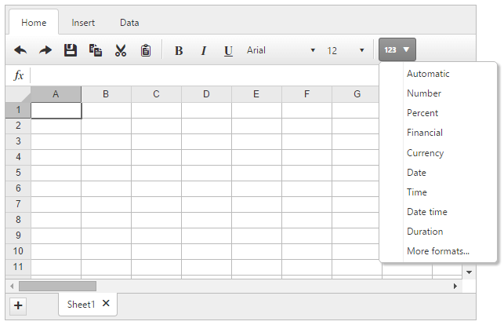
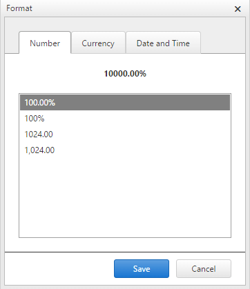

# Cell Format Overview

**RadSpreadsheet** supports many cell-formatting options such as formatting of strings, text, numbers, dates, and time, which can be invoked from the Format dialog. 

Format Button:

 

Format Dialog:

 

## Customizing the cell-formatting options

**RadSpreadsheet** supports [customization]() of its cell-formatting options and additional ones can be included. 

# See Also

* [Spreadsheet - Custom CellFormat]()

