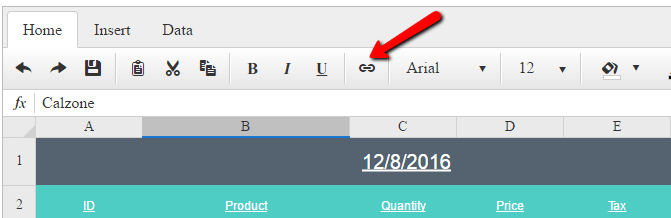
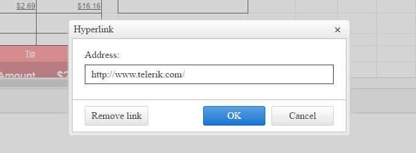

# Cell Format Overview

As from R3 2016 **RadSpreadsheet** provides the ability to define hyperlink for its cells content. 

You can define a hyperlink for a given cell in two ways:

1. Using the ToolbarTab(see **Figure 1**), which will prompt you with a popup, where you can set the needed url (see **Figure 2**)

	>caption Figure 1 shows the ToolbarTab used to open the popup.
	**Figure 1**: 
	 

	>caption Figure 2 illustrates the popup where you can set the hyperlink for the cell.
	**Figure 2**: 
	 

	From the popup, you can also remove a hyperlink, using the **Remove link** button.

2. Programatically, using the Client API of the RadSpreadsheet and the SpreadsheetRange object.

	>caption The following example demonstrates how to programatically set hyperlink for a certain cell.
	
	````JavaScript	

	function setHyperlink() {
		var spreadsheet = $find("<%= RadSpreadsheet1.ClientID %>");
		var activeSheet = spreadsheet.get_activeSheet();
		var singleCellRange = activeSheet.get_range("B3")
		singleCellRange.set_link("www.telerik.com");
	}
	
	````	
	
## See Also
[RadSpreadsheet Full Set of Tools Demo](http://demos.telerik.com/aspnet-ajax/spreadsheet/examples/spreadsheettoolbar/defaultcs.aspx)