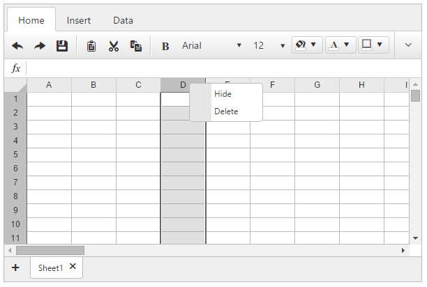
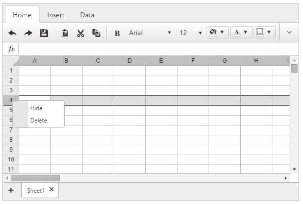
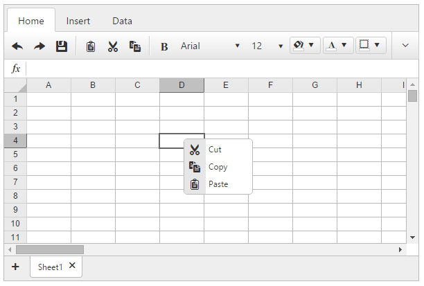

# Context Menu Overview

**RadSpreadsheet** supports its own built-in ContextMenus. Right-clicking on a column header, row header or cell range will open the corresponding ContextMenu:

* ColumnHeaderContextMenu

* RowHeaderContextMenu

* CellContextMenu

Each ContextMenu contains a number of action items. The ColumnHeaderContextMenu and RowHeaderContextMenu allow the user to hide or delete a column or a row correspondingly. The CellContextMenu allows interaction with cell range content: cut, copy, paste.

# See Also

* [Spreadsheet - Custom ContextMenu]()

