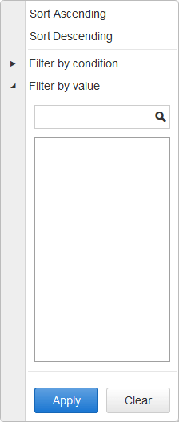
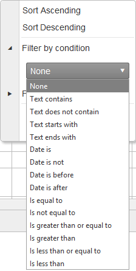
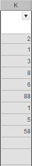
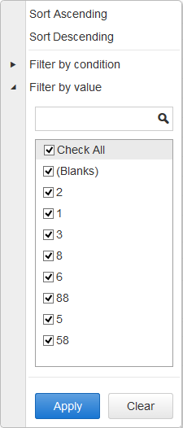

# Filter Menu Overview

The Filter Menu is a built-in functionality of the RadSpreadsheet control, that provides you with the ability to sort or filter the values of cell range (see **Figure 1**). The idea behind sorting and filtering is to apply these operations on a column that contains a set of cells, which needs to be managed. Using the Filter Menu, you will be able to choose between ascending,descending or simply no sorting. As for the filtering, you are able to either filter by condition or value. In addition, the **RadSpreadsheet** control provides the ability to define a custom Filter Menu, using the **FilterMenuTemplate** ([see Custom validation article] ()).

**Figure 1**: 
 

You can enable the **Filter Menu** functionality either by declaring the **Filter** tool in the **SpreadsheetToolbarGroup** of a certain **SpreadsheetToolbarTab** or using the Client API of **SpreadsheetRange** object:

>caption The example below demonstrates declarative initialization of the Filter tool.
````ASPNET
 <telerik:RadSpreadsheet runat="server" ID="RadSpreadsheet1" Skin="Default">
            <Toolbar>
                <telerik:SpreadsheetToolbarTab Text="Filter and Sort">
                    <telerik:SpreadsheetToolbarGroup>
                        <telerik:SpreadsheetTool Name="Sort" ShowLabel="true" />
                        <telerik:SpreadsheetTool Name="Filter" ShowLabel="true" />
                    </telerik:SpreadsheetToolbarGroup>
                </telerik:SpreadsheetToolbarTab>
            </Toolbar>
        </telerik:RadSpreadsheet>

````

>caption The following example demonstrates how to enable the Filter tool, using the Client API of the RadSpreadsheet
````JavaScript	

function enableFilterMenu() {
	var spreadsheet = $find("<%= RadSpreadSheet1.ClientID %>");
	var activeSheet = spreadsheet.get_activeSheet();
	var singleCellRange = activeSheet.get_range("A1")  
	singleCellRange.set_filter(true);
}

````


## Filter Menu Structure
1. Sorting 

 In the top part of the dialog (see **Figure 1**) you can find the sorting buttons. You can choose between ascending or descending sort, while if you click on the **Clear** button, the sorting in the specified range of cells will be cleared.
 
2. Filter
 
 There are two general options for filtering - **Filter by condition** and **Filter by value**:
 
  * **Filter by condition**  - If this option is selected from the dialog, you will have the ability to select another option from a dropdown. This dropdown contains predefined filter conditions. Selecting one of the options, you will filter the cells in the specified column, hence, only the cells, which content matched the selected criteria will be visible.(see **Figure 2**)
  
	**Figure 2**: 
	

 
  * **Filter by value** - This functionality enables you to manage the visibility of the cells that matches a specific value filled in the textbox area  Once a given value is filled in the textbox, you will be able to observe the cells' content that matches this value in the area below(see **Figure 3**).
  
 >caption **Figure 3** demonstrates an examplary content of a Column's cells and how the Filter by value can be applied
	 &nbsp;&nbsp;&nbsp;&nbsp;&nbsp;&nbsp;        
 
 ## See Also
[RadSpreadsheet FilterSort Demo](http://demos.telerik.com/aspnet-ajax/spreadsheet/examples/filterandsort/defaultcs.aspx)
 

 