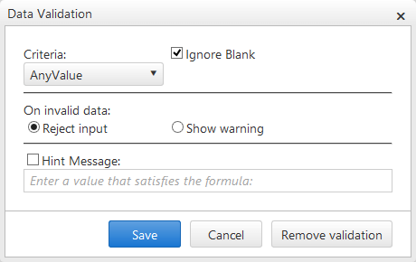
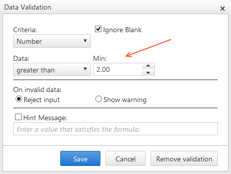
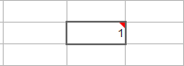

# Validation Overview

The Data Validation dialog is a built-in functionality that the RadSpreadsheet control provides, in order to enable you to create special validation rules for the selected cell or range of cells (see **Figure 1**). When configuring the validation trough the dialog, you will have the choice to select between different criteria for **Number**, **Text** and **DateTime** data types as well as a custom rules (CustomFormula). In addition, the **RadSpreadsheet** control provides the ability to define a custom Validation Dialog, using the **ValidationTemplate** ([see Custom validation article] ()).

>caption Figure 1 exhibits the default Data Validation dialog of RadSpreadsheet.

**Figure 1**: 

## Validation Dialog Structure

1. Criteria

 In the top part of the dialog, you can configure the validation criteria that the content of the selected cell(s) should meet. As mentioned above, you can choose between **Number**, **Text** and **DateTime** data types as well as a **CustomFormula**. Once а certain option is selected, you can specify these criteria further. For example, you can define a minimum number value that the data of the cell should be greater then. (see **Figure 2**)
 
 >caption Figure 2 demonstrates specific validation against Number data type.
 **Figure 2**: 

2. Invalid data
 
  You can choose between two options for handling the invalid data: **Reject input** and **Show Warning**.(see **Figure 1** and **Figure 2**)
	* **Reject input** - if this option is selected, the end user will not be able to submit the invalid content for the cell, until he enters data that meets the predefined validation criteria. On each attempt to submit invalid data, a popup will be shown, describing that the value violates the validation rule.
	* **Show warning** - if this option is selected, the end user will be able to submit the invalid data, but a warning toggle will be displayed, notifying that the content is not valid. (see **Figure 3**)
 >caption Figure 3 demonstrates the warning toggle, displayed when invalid data is filled.
 **Figure 3**: 
 	
3. Hint Message

 You have the ability to set a custom, more explicable message that will inform the end user when the data that he attempts to submit is invalid. You need to check the **Hint Message** checkbox and specify the custom message in order to enable the functionality. In the case when the **Reject input** option is selected in the **Invalid Data** section, the custom text configured in the textbox will be displayed to the user within a popup. If **Show warning** option is selected, the message defined in the textbox will be displayed as a tooltip, when the warning toggle is hovered.

  ## See Also
[RadSpreadsheet Validation Demo](http://demos.telerik.com/aspnet-ajax/spreadsheet/examples/validation/defaultcs.aspx)
 