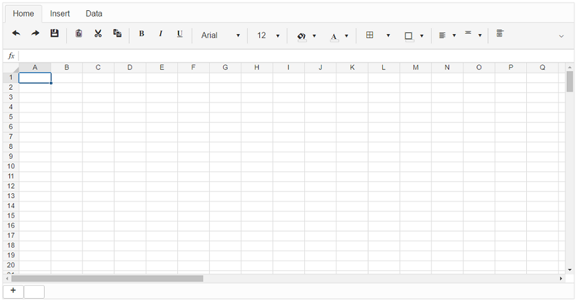

# Getting Started


This article will get you started in using the **RadSpreadsheet** control. It contains the following sections:


* [Assembly References](#assembly-references)

* [Creating a Simple RadSpreadsheet](#creating-a-simple-radspreadsheet)

* [Binding a RadSpreadsheet to a provider at runtime](#binding-a-radspreadsheet-to-a-provider-at-runtime)


## Assembly References

In order to use the **RadSpreadsheet** control in your project you need to add references to the following assemblies:

* **Telerik.Web.Spreadsheet.dll**
* **Newtonsoft.Json.dll**

@[template - path-to-additional-libraries](/_templates/common/additional-libraries-path.md#additional-libraries-path "assemblies: the needed assemblies, support: They support, isplural: assemblies")

The following assemblies are required in order to be able to use the control with the predefined [**SpreadsheetDocumentProvider**]() (applicable for most scenarios):

@[template - spreadsheet-additional-libraries](/_templates/spreadsheet/additional-libraries.md#additional-libraries-explanation)


>note You could find the above assemblies in the **AdditionalLibraries** folder of the installation directory on your machine (C:\Program Files (x86)\Telerik\UI for ASP.NET AJAX [XX] [XXXX]).
>


## Creating a Simple RadSpreadsheet

To create a new instance of RadSpreadsheet on your page using the designer, you should follow the below steps:

* Drag a RadSpreadsheet control from the Toolbox onto your Web Page.

* The Smart Tag should appear automatically. Within the Smart Tag menu, from the Skin drop-down chose the desired Skin for this control:


* Run the application. You should see the newly created empty RadSpreadsheet on your page:




## Binding a RadSpreadsheet to a provider at runtime

Binding the RadSpreadsheet to a provider at runtime requires two simple steps:

* Create an excel file and copy it to the App_Data folder of your project. In this example we have created a file with a name "Spreadsheet.xlsx".

* Set the **Provider** property in the code behind, by assigning it an instance of the Telerik.Web.UI.SpreadsheetDocumentProvider class, with the path to the excel file as a parameter:

````C#

protected void Page_Init(object sender, EventArgs e)
{
	RadSpreadSheet1.Provider = new SpreadsheetDocumentProvider(Server.MapPath("~/App_Data/Spreadsheet.xlsx"));
}
	
````
````VB

Protected Sub Page_Init(sender As Object, e As EventArgs)
	RadSpreadSheet1.Provider = New SpreadsheetDocumentProvider(Server.MapPath("~/App_Data/Spreadsheet.xlsx"))
End Sub

````

You have now bound your RadSpreadsheet using the Provider property at runtime:


# See Also

 * [Overview]()

 * [Known limitations]()
