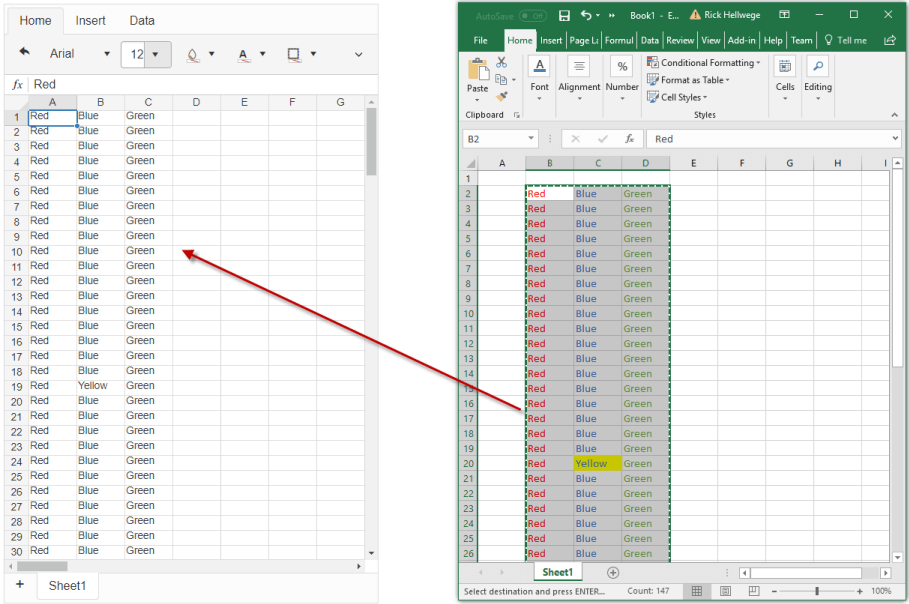

# How to Paste data-only in the RadSpreadSheet

This help article shows how to paste data-only into the **RadSpreadSheet**, removing all styles from the source data.

Occasionally, it is desirable to only paste the raw data into the **RadSpreadSheet**. If substancial amounts of data are being copied and pasted into the RadSpreadSheet, parsing and rendering the content could take a long time. Removing the styling will both reduce the volumn of data pasted, and speed up the rendering. See **Figure 1** for an example of pasting data-only.

>caption Figure 1: A RadSpreadSheet with styled source data pasted using data-only.



````JavaScript
kendo.spreadsheet.Clipboard.prototype.paste = function () {
    var sheet = this.workbook.activeSheet();
    var pasteRef = this.pasteRef();
    var content = this._content;
    content.data = stripData(content.data);
    sheet.range(pasteRef).setState(content, this);
    sheet.triggerChange({ recalc: true, ref: pasteRef });
}

function stripData(source) {
    var data = Array.isArray(source) ? [] : {};
    for (var key in source) {
        if (source.hasOwnProperty(key)) {
            var t = typeof source[key];
            if (key === "value") {
                data[key] = source["value"];
            } else if (source[key] === null) {
                data[key] = null;
            } else {
                data[key] = t === 'object' ? stripData(source[key]) : null;
            }
        }
    }
    return data;
}
````
````ASP.NET
<telerik:RadSpreadsheet ID="RadSpreadsheet1" runat="server" Width="500" Height="800">
</telerik:RadSpreadsheet>
````


## See Also

 * [RadSpreadsheet Object](https://docs.telerik.com/devtools/aspnet-ajax/controls/spreadsheet/client-side-programming/objects/radspreadsheet)


