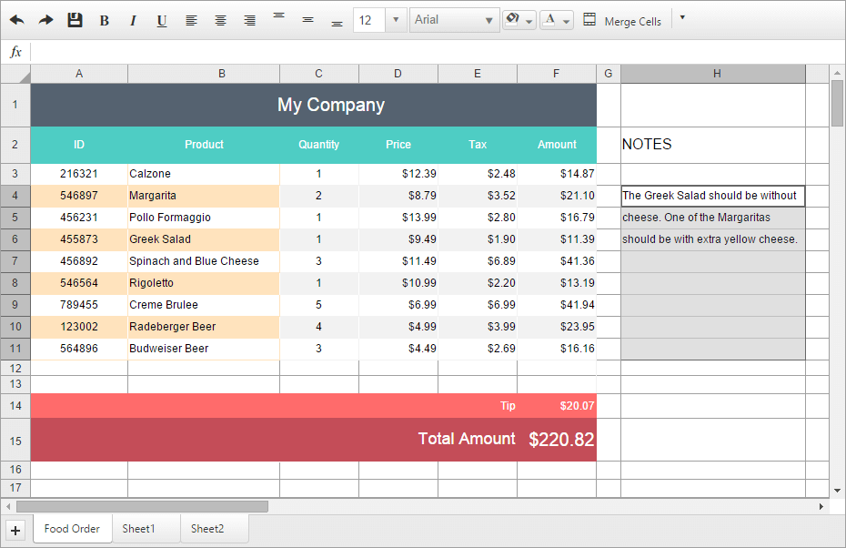

# Spreadsheet Overview

**RadSpreadsheet** for ASP.NET AJAX is a control that allows editing tabular data utilizing a variety of cell formatting options, functions and styles. 
## 

>important  **RadSpreadsheet** is not supported for .NET Framework 3.5. and Internet Explorer 8.

**Telerik Spreadsheet (Figure 1)** provides the user the ability to:

* Work with MS Excel files (.xlsx)

* Create, delete and reorder Worksheets

* Set custom styles to cells, rows, columns or regions

* Resize rows and columns

* Merge cells

* Intuitive Column, Row and Cell Selection

* Use different data formats (currency, percent etc.)

**Figure 1**: 
