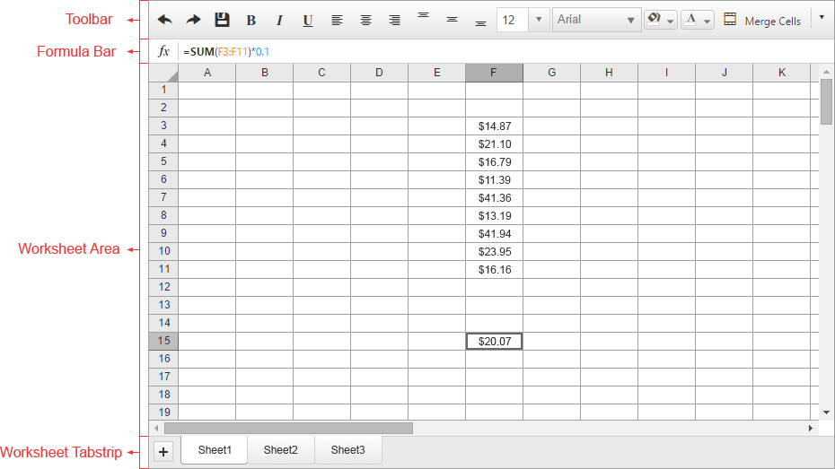

# RadSpreadsheet Layout

The **RadSpreadsheet** is divided into several areas:

* The **Toolbar** contains commonly used commands that can be used to interact with the Spreadsheet. The types of controls inside the toolbar include buttons, toggle buttons, split buttons, dropdowns, comboboxes and color pickers.

* The **Formula bar** contains information about the currently active cell or region, such as it's content or formula. It can be used for editing. 

* The **Worksheet area** displays the currently selected Worksheet. The control utilizes virtual scrolling to easily handle large amounts of data without performance drawbacks.

* The **Worksheet tabstrip** can be used to navigate between the different Worksheets, choosing which one is displayed in the Worksheet area. It can also be used to add, remove and reorder Worksheets. 

The image below illustrates the basic layout of the **RadSpreadsheet**.

