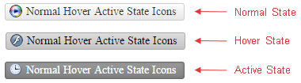

# Icons Overview

This help article showcases how to setup custom and embedded icons in **RadStandardButton** for its different states and fine tune their position.

1. [Configure RadStandardButton With an Icon](#configure-radstandardbutton-with-an-icon)

1. [Fine-tune Icon Position](#fine-tune-icon-position)

1. [Use Embedded Icons](#use-embedded-icons)

## Configure RadStandardButton With an Icon

You can make your button more intuitive by showing an icon on the left-hand side of the control (**Example 1** and **Figure 1**). All the Icon-related properties are controlled through the **RadStandardButton.Icon** inner property. To display an icon on the button, you need to set either the **Icon.Url** property, or the **Icon.CssClass** property.

>caption Figure 1: A RadStandardButton with an icon.


>caption Example 1: Configure a **RadStandardButton** with an icon through the **Icon.Url** and **Icon.CssClass** properties.

````ASP.NET
<style type="text/css">
	.classNextArrow {
		background-image: url('http://demos.telerik.com/aspnet-ajax/button/examples/embeddedicons/images/rbPredefinedIcons.png');
	}

	.classNextArrow {
		background-position: -168px 0;
	}
</style>

<telerik:RadStandardButton ID="RadStandardButton1" runat="server" Text="Button With Two Icons">
	<Icon Url="http://demos.telerik.com/aspnet-ajax/button/examples/embeddedicons/images/rbPredefinedIcons.png" 
		CssClass="classNextArrow" />
</telerik:RadStandardButton>
````

**RadStandardButton** provides an easy way to show different icon when the mouse is over the control, or the button is pressed (**Figure 2** and **Example 2**). This is achieved through the properties shown in **Table 1**.

>caption Table 1: RadStandardButton properties that control the hovered and active states of the icon. 

| Button State | Primary Icon Property |
| ------ | ------ | ------ |
|Hovered| **Icon.HoveredCssClass** |
|Active(Pressed)| **Icon.PressedCssClass** |
>caption Figure 2: A RadStandardButton can have different icons for its normal, hovered and active state.



**Example 2:** Setup unique icons for the normal, hovered and active state of a **RadStandardButton**.

````ASP.NET
<style>
	.classNextArrow, .classPreviousArrow {
		background-image: url('http://demos.telerik.com/aspnet-ajax/button/examples/embeddedicons/images/rbPredefinedIcons.png');
	}
	
	.classNextArrow {
		background-position: -168px 0;
	}

	.classPreviousArrow {
		background-position: -144px 0;
	}
</style>

<telerik:RadStandardButton ID="RadStandardButton1" runat="server" Text="Button With Two Icons">
	<Icon PrimaryIconUrl="http://demos.telerik.com/aspnet-ajax/button/examples/embeddedicons/images/rbPredefinedIcons.png" PrimaryIconCssClass="classNextArrow"
		SecondaryIconCssClass="classPreviousArrow" />
</telerik:RadStandardButton>
````

## Fine-tune Icon Position

At first the Icons might not be positioned exactly the way we want, but this can be easily changed by directly setting the properties that control the top, bottom, left or right offset of the respective icon (**Table 2**):

>caption  Table 2: RadStandardButton properties that control the offset of the icon. 

| Offset | Primary Icon Property |
| ------ | ------ | ------ |
|Top| **Icon.Top** |
|Bottom| **Icon.Bottom** |
|Left| **Icon.Left** |
|Right| **Icon.Right** |

Alternatively, a CSS class can be set to the icon, and the position configured using CSS.

1. Properties:

	**ASP.NET**
	
		<telerik:RadStandardButton ID="RadStandardButton2" runat="server" Text="Spell Check Html">
			<Icon PrimaryIconUrl="http://demos.telerik.com/aspnet-ajax/button/examples/customicons/images/eSpellCheck.png" 
				PrimaryIconTop="4px" PrimaryIconLeft="5px"
				SecondaryIconUrl="http://demos.telerik.com/aspnet-ajax/button/examples/customicons/images/eHtml.png" 
				SecondaryIconTop="4px" SecondaryIconRight="5px" />
		</telerik:RadStandardButton>

1. Or the same configuration using CSS classes:

	**CSS**
	
		<style type="text/css">
			.classSpellCheck {
				top: 4px;
				left: 5px;
			}

			.classHtml {
				top: 4px;
				right: 5px;
			}
		</style>

	**ASP.NET**

		<telerik:RadStandardButton ID="RadStandardButton3" runat="server" Text="Spell Check Html">
			<Icon PrimaryIconUrl="http://demos.telerik.com/aspnet-ajax/button/examples/customicons/images/eSpellCheck.png" PrimaryIconCssClass="classSpellCheck"
				SecondaryIconUrl="http://demos.telerik.com/aspnet-ajax/button/examples/customicons/images/eHtml.png" SecondaryIconCssClass="classHtml" />
		</telerik:RadStandardButton>
	
	
	>caption Figure 3: The icon in RadStandardButton can be offset.

	

## Use Embedded Icons

To make the control even easier to use **Telerik** provides a large set of built-in icons. To use them, set the **Icon.CssClass** property to one of the predefined CSS class names, and the respective icon will be shown on the control. The full list of the CSS classes can be found in **List 1**.

>caption List 1: CSS classes of embedded icons in **RadStandardButton**.

* rbAdd
* rbRemove
* rbOk
* rbCancel
* rbUpload
* rbDownload
* rbPrevious
* rbNext
* rbOpen
* rbAttach
* rbSave
* rbConfig
* rbPrint
* rbRefresh
* rbSearch
* rbHelp
* rbCart
* rbEdit
* rbRSS
* rbMail
* rbFB
* rbTwitter

>note The **CssClass** is composed in the following way: [**r**]ad[**b**]utton[**IconName**]. For example **rbAdd**.

The embedded icons of **RadStandardButton** are font icons (**Figure 2**). Using a font facilitates the customization of the icons. For example, you can change the icons color and font size with a single line of CSS (**Figure 3** and **Example 3**).

>caption Figure 2: Embedded icons of RadStandardButton for Default and Black skin.


>caption Example 2: Declaration of two RadStandardButton control with icons for Default and Black skin.

````ASP.NET
<telerik:RadStandardButton ID="RadStandardButton1" runat="server" Text="Default Skin" Skin="Default">
	<Icon CssClass="rbOk" />
</telerik:RadStandardButton>

<telerik:RadStandardButton ID="RadStandardButton2" runat="server" Text="Black Skin" Skin="Black">
	<Icon CssClass="rbOk" />
</telerik:RadStandardButton>
````

>caption Figure 3: You can easily customize the font size and color of the embedded icons of RadStandardButton with CSS.


>caption Example 3: Use only CSS to modify the font size and color of embedded icons in RadStandardButton.

````ASP.NET
<style type="text/css">
	button.RadButton.customizeIcon .rbPrimaryIcon {
		color: red;
		font-size:15px;
	}
</style>

<telerik:RadStandardButton ID="RadStandardButton1" runat="server" Text="Icon Custom Size and Color" CssClass="customizeIcon">
	<Icon CssClass="rbSave" Top="2px" />
</telerik:RadStandardButton>
````

## See Also

 * [Button - Embedded Icons Online Demo](http://demos.telerik.com/aspnet-ajax/button/examples/embeddedicons/defaultcs.aspx)

 