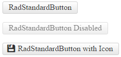

# StandardButton Overview

The **RadStandardButton** control (**Figure 1**) enriches the features, that ASP.NET Button control has. It provides additional events, ability to define icons and content template, a mechanism to prevent multiple postbacks and numerous themes. 

The control can be easily styled by changing the **Skin** property, and alternatively setting properties that change the look of the control. This will eliminate the need to use the [RadFormDecorator](), just to style a single button. Developers can easily migrate their applications from using the standard ASP.NET (button) controls to the new **RadStandardButton** control, because most of their functionality is provided by our control, and is controlled by the same or similar (intuitive) properties.

>note **RadStandardButton** doesn't support a Classic render mode. Setting a Classic render mode will default to the Lightweight render mode.

>caption Figure 1: RadStandardButton control provides a rich API and UI.

## See Also

 * [RadStandardButton Online Demos](http://demos.telerik.com/aspnet-ajax/standardbutton/examples/overview/defaultcs.aspx)
 
 * [RadStandardButton Getting Started]()
 
 * [RadStandardButton Properties and Events]()
 
 * [FormDecorator Overview]()