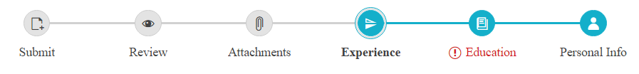

# Right-to-left Support

The RadStepper supports right-to-left (RTL) language locales. In order to turn on the RTL support, you should set the *dir="rtl"* and add the *"k-rtl"* class to the parent element of the Control. The *"k-rtl"* class is needed to ensure the proper orientation of the Icons.

For example you can wrap the Stepper in a &lt;div dir="rtl" class="k-rtl"&gt; element:



````ASP.NET
<div dir="rtl" class="k-rtl">
    <telerik:RadStepper runat="server" ID="RadStepper1" Skin="Silk" RenderMode="Lightweight" Width="750" ShowIndicator="true">
        <Steps>
            <telerik:StepperStep Label="Personal Info" Icon="user" />
            <telerik:StepperStep Label="Education" Error="true" Icon="dictionary-add" />
            <telerik:StepperStep Label="Experience" Icon="flip-vertical" Selected="true" />
            <telerik:StepperStep Label="Attachments" Icon="attachment" SuccessIcon="success" />
            <telerik:StepperStep Label="Review" Icon="preview" Enabled="true" />
            <telerik:StepperStep Label="Submit" Icon="file-add" />
        </Steps>
    </telerik:RadStepper>
</div>
````


# See Also

 * [Right-to-Left Support demo](https://demos.telerik.com/aspnet-ajax/stepper/accessibility-and-internationalization/rtl/defaultcs.aspx)
 

