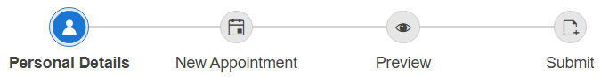
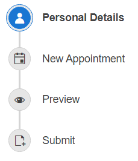
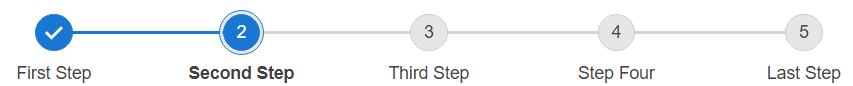
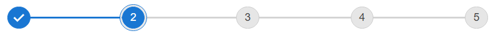

# Appearance 

The Stepper is rendered horizontally with an indicator element and a label for each Step. The Stepper provides the possibility to customize all of these configurations.

## Orientation

The orientation of the Stepper could be configured via the `Orientation` property which Indicates whether the Stepper will be rendered vertically or horizontally (default).

````ASPX
<telerik:RadStepper runat="server" ID="RadStepper1" Orientation="Vertical">
````

#### Horizontal (by default)



#### Vertical



Test how the `Orientation` property affects the Stepper in our [Orientation demo](https://demos.telerik.com/aspnet-ajax/stepper/orientation/defaultcs.aspx).

## Layout

By default both the Label and the Indicator(Icon) of each Step are displayed. The Stepper layout could be configured via the `ShowLabel` and `ShowIndicator` properties. By default both properties are enabled.

Based on the values set to the `ShowLabel` and `ShowIndicator` properties, three major layouts can be achieved:

#### Labels and Indicators (default)

````ASPX
<telerik:RadStepper runat="server" ID="RadStepper1" ShowIndicator="true" ShowLabel="true">
````



#### Labels only

````ASPX
<telerik:RadStepper runat="server" ID="RadStepper1" ShowIndicator="false" ShowLabel="true">
````


#### Indicators only

````ASPX
<telerik:RadStepper runat="server" ID="RadStepper1" ShowIndicator="true" ShowLabel="false">
````



Check out the three options in our [Layout live demo](https://demos.telerik.com/aspnet-ajax/stepper/layout/defaultcs.aspx).

# See Also

 * [Icons]() 
 * [Stepper Steps]() 
 * [Operation Modes]() 
 * [Layout demo](https://demos.telerik.com/aspnet-ajax/stepper/layout/defaultcs.aspx)


