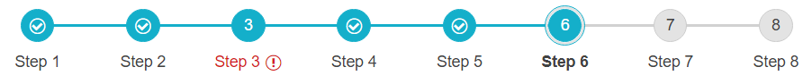
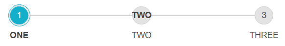
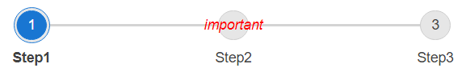

# Icons

The Stepper allows configuring the icons in the Steps indicator elements. All the built-in icons distributed with Telerik UI for ASP.NET AJAX suite can be used in **RadStepper**.

In addition, all the [Kendo UI Web Font Icons](https://docs.telerik.com/kendo-ui/styles-and-layout/icons-web#list-of-font-icons) are also available for using in the component.

To include a desired embedded icon use the exposed icon properties - `Icon`, `SuccessIcon` of the **RadStepper**. The `ClientIconTemplate` exposed by **RadStepper** provides flexibility in customizing the icon.

## Step Icon

The icons rendered for each StepperStep. It is also clickable and can be configured through the `Icon` property of each **StepperStep**.

By default, the Step icon is visible. To hide the icons in RadStepper set its `ShowIndicator` property to *'false'*. If no Icon is specified for a Step, the consecutive number of the Step is rendered as its icon.

Sample usage of Icons:


Below is the code producing this result:

````ASP.NET
<telerik:RadStepper runat="server" ID="RadStepper1">
    <Steps>
        <telerik:StepperStep Label="Home" Icon="home" />
        <telerik:StepperStep Label="Settings" Icon="gear" />
        <telerik:StepperStep Label="Attachments" Icon="attachment" />
        <telerik:StepperStep Label="Save" Icon="save" />
    </Steps>
</telerik:RadStepper>
````

## Success Icon

Defines Icons rendered in a previously completed/selected step with no error. It can be configured through the `SuccessIcon` property of a **StepperStep** element.

When no `SuccessIcon` is specified for a Step, the icon in a completed step remains the one set to its `Icon` property. In case a Step has neither an `Icon` or `SuccessIcon` specified, a default checkmark icon is applied as SuccessIcon.



Sample declaration:

````ASPX
<telerik:RadStepper runat="server" ID="RadStepper3" Width="750" Skin="Silk">
    <Steps>
        <telerik:StepperStep Label="Step 1" SuccessIcon="success" />
        <telerik:StepperStep Label="Step 2" SuccessIcon="success" />
        <telerik:StepperStep Label="Step 3" Error="true" SuccessIcon="success" />
        <telerik:StepperStep Label="Step 4" SuccessIcon="success" />
        <telerik:StepperStep Label="Step 5" SuccessIcon="success" />
        <telerik:StepperStep Label="Step 6" SuccessIcon="success" Selected="true" />
        <telerik:StepperStep Label="Step 7" SuccessIcon="success" />
        <telerik:StepperStep Label="Step 8" SuccessIcon="success" />
    </Steps>
</telerik:RadStepper>
````

## ClientIconTemplate

**RadStepper** uses [Kendo UI Templates](https://docs.telerik.com/kendo-ui/framework/templates/overview) to provide full control over the rendering of the icon in the indicator of each step.

The fields which can be used in the template are:

 - `label` *String* - the label set on the step
 - `icon` *String* - the icon specified for this step (if any)
 - `successIcon` *String* - the successIcon specified for this step (if any)
 - `enabled` *Boolean* - indicates whether the step is enabled (true) or disabled (false)
 - `error` *Boolean* - indicates whether the step has error (true) or not (false)
 - `selected` *Boolean* - indicates whether the step is selected
 - `previous` *Boolean* - indicates whether the step is before the currently selected or not
 - `index` *Number* - a zero-based index of the current step
 - `isFirstStep` *Boolean* - indicates whether the step is the initial one in the Stepper
 - `isLastStep` *Boolean* - indicates whether the step is the last one in the Stepper
 - `indicatorVisible` *Boolean* - indicates whether the indicator, which holds the icon should be displayed or not
 - `labelVisible` *Boolean* - indicates whether the label section of the step should be displayed or not

>caption Example



Markup declaration of the Stepper shown above:

````ASPX
<telerik:RadStepper runat="server" ID="RadStepper1" Skin="Silk">
    <Steps>
        <telerik:StepperStep Label="ONE"/>
        <telerik:StepperStep Label="TWO">
            <ClientIconTemplate>
                <strong>#: label #</strong>
            </ClientIconTemplate>
        </telerik:StepperStep>
        <telerik:StepperStep Label="THREE"/>
    </Steps>
</telerik:RadStepper>
````

The default appearance of a StepperStep can be achieved with the template declaration shown below. It can serve as a convenient basis for further modifications:

````ASPX
<telerik:StepperStep Label="Step 1" Icon="home" SuccessIcon="success" Enabled="true" Error="false" Selected="false" >
    <ClientIconTemplate>
        #if(successIcon && previous && !error) {#
            <span class="k-step-indicator-icon k-icon k-i-#: successIcon #"></span>#
        }
        else if(icon) {#
            <span class="k-step-indicator-icon k-icon k-i-#: icon #"></span>
        #}
        else if(previous && !error) {#
            <span class="k-step-indicator-icon k-icon k-i-check"></span>
        #} else {#
            <span class="k-step-indicator-text">#: index + 1 #</span>
        #}#
    </ClientIconTemplate>
</telerik:StepperStep>  
````

With the declaration above, the Indicator element of the Step should be the same as if ClientIconTemplate is not in use.

>caption Custom Attributes

The StepperStep object exposes `Attributes` property that can be used for processing additional information inside the `ClientIconTemplate`.
Check out the example below to see how to use Step's custom attribute in the Template:



````ASPX
<telerik:RadStepper runat="server" ID="RadStepper1" Width="600px">
    <Steps>
        <telerik:StepperStep Label="Step1"></telerik:StepperStep>
        <telerik:StepperStep Label="Step2">
            <ClientIconTemplate>
                <span style="color:red">
                    <em>#: data.attributes['my-custom-attribute'] #</em>
                </span>
            </ClientIconTemplate>
        </telerik:StepperStep>
        <telerik:StepperStep Label="Step3"></telerik:StepperStep>
    </Steps>
</telerik:RadStepper>
````

````C#
protected void Page_Load(object sender, EventArgs e)
{
    foreach (StepperStep step in RadStepper1.Steps)
    {
        step.Attributes.Add("my-custom-attribute", "important");
    }
}
````
````VB
Protected Sub Page_Load(ByVal sender As Object, ByVal e As EventArgs)
    For Each step As StepperStep In RadStepper1.Steps
        step.Attributes.Add("my-custom-attribute", "important")
    Next
End Sub
````

# See Also

 * [Icons live demo](https://demos.telerik.com/aspnet-ajax/stepper/icons/defaultcs.aspx) 
 * [Stepper Steps]() 
 * [Operation Modes]() 
 * [Appearance]() 


