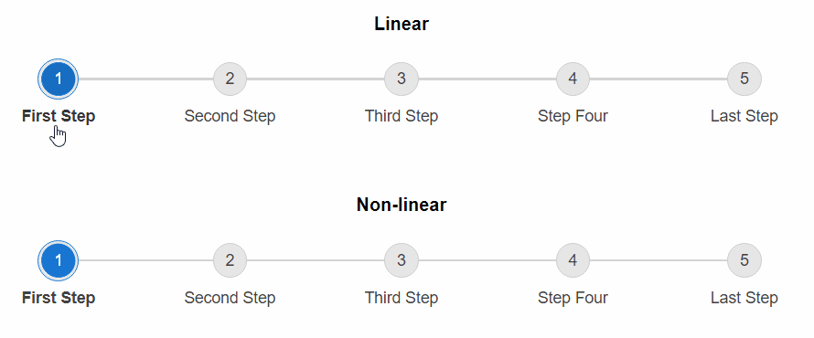

# Operation Modes

By setting the `Linear` property of **RadStepper** you can determine whether the Stepper will force the user to follow the Steps sequence or not. 

 - When set to "true" (by default), the user is allowed to select any Step of the Stepper regardless of the current selection. 

 - When set to "false", the user is allowed to select only the Steps right before or after the currently selected Step. Skipping a step is not possible in this case.

The below example demonstrates the difference in both modes:



Sample declaration to achieve the non-linear behavior shown above:

````ASP.NET
<telerik:RadStepper runat="server" ID="RadStepper1" Linear="false">
    <Steps>
        <telerik:StepperStep Label="First Step" />
        <telerik:StepperStep Label="Second Step" />
        <telerik:StepperStep Label="Third Step" />
        <telerik:StepperStep Label="Step Four" />
        <telerik:StepperStep Label="Last Step" />
    </Steps>
</telerik:RadStepper>
````

Test this functionality in our [Operation Modes live demo](https://demos.telerik.com/aspnet-ajax/stepper/operation-modes/defaultcs.aspx).

# See Also

 * [RadStepper Operation Modes demo](https://demos.telerik.com/aspnet-ajax/stepper/operation-modes/defaultcs.aspx)
 * [Stepper Steps]() 
 * [Icons]() 
 * [Appearance]() 


